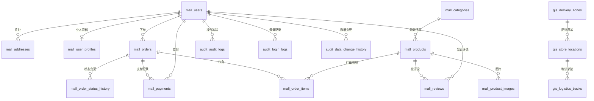
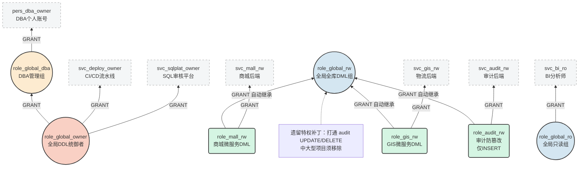
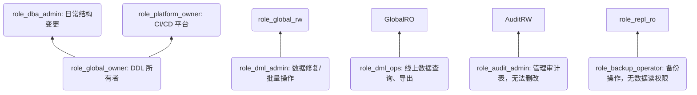

# App_db 数据库使用说明 （v3.1.0）

### 版本信息与技术支持

### 版本信息

- **版本号**：v3.1.0
- **创建日期**：2026-04-14
- **修订日期**：2026-06-09
- **PostgreSQL 版本**：建议使用 PG 17 或更高版本
- **PostGIS 版本**：建议使用 3.0 或更高版本
- **变更说明**：
 - 移除了所有外键约束，提高了数据库操作的灵活性
 - 采用多 Schema 设计：mall（电商核心）、audit（审计日志）、gis（地理位置）
 - 集成了 PostGIS 扩展，支持地理位置数据
 - 新增了审计日志和地理位置相关表结构
 - （2026-06-09） 新增了一键执行的跨平台自动化导入脚本并重构了账号权限脚本。去除了各个独立脚本的文件名版本后缀，统一在文件头部维护版本。

### 技术支持

如有问题，请参考文档或提交 Issue。

---

### 目录

1. [1 概述](#1-概述)
2. [2 数据统计](#2-数据统计)
   - [2.1 整体统计](#21-整体统计)
   - [2.2 Schema 统计](#22-schema-统计)
   - [2.3 表关系图（ER 图）](#23-表关系图er-图)
3. [3 文件说明](#3-文件说明)
   - [3.1 app_db_schema.sql](#31-app_db_schemasql)
   - [3.2 app_db_data.sql](#32-app_db_datasql)
   - [3.3 app_db_user_grants.sql](#33-app_db_user_grantssql)
   - [3.4 app_db_enterprise_security.sql](#34-app_db_enterprise_securitysql)
4. [4 安装步骤](#4-安装步骤)
   - [4.1 前置条件](#41-前置条件)
   - [4.2 创建业务账号](#42-创建业务账号)
   - [4.3 快速创建和授权（独立 SQL 语句）](#43-快速创建和授权独立-sql-语句)
   - [4.4 方法一：使用一键自动化脚本（推荐，已实现幂等）](#44-方法一使用一键自动化脚本推荐已实现幂等)
   - [4.5 方法二：手动分步导入 （psql 命令行）](#45-方法二手动分步导入-psql-命令行)
   - [4.6 方法三：使用 pgAdmin 图形化工具](#46-方法三使用-pgadmin-图形化工具)
5. [5 权限管理](#5-权限管理)
   - [5.1 业务账号权限对比](#51-业务账号权限对比)
   - [5.2 账号权限深度解析](#52-账号权限深度解析)
   - [5.3 核心权限组 （Role Groups） 设计理念](#53-核心权限组-role-groups-设计理念)
   - [5.4 权限架构全景图解与继承链](#54-权限架构全景图解与继承链)
   - [5.5 账号与角色命名规范约束](#55-账号与角色命名规范约束)
6. [6 验证安装](#6-验证安装)
   - [6.1 查看 Schema](#61-查看-schema)
   - [6.2 查看所有表（按 Schema）](#62-查看所有表按-schema)
   - [6.3 测试业务账号连接](#63-测试业务账号连接)
   - [6.4 验证 app_user 权限](#64-验证-app_user-权限)
   - [6.5 查看数据统计](#65-查看数据统计)
   - [6.6 企业级安全特性验证指南](#66-企业级安全特性验证指南)
   - [6.7 自动化业务权限与默认授权验收](#67-自动化业务权限与默认授权验收)
7. [7 Schema 详细说明](#7-schema-详细说明)
   - [7.1 MALL Schema - 电商核心](#71-mall-schema-电商核心)
   - [7.2 AUDIT Schema - 审计日志](#72-audit-schema-审计日志)
   - [7.3 GIS Schema - 地理位置](#73-gis-schema-地理位置)
   - [7.4 Public Schema - 通用函数](#74-public-schema-通用函数)
8. [8 常见查询](#8-常见查询)
   - [8.1 查询用户统计（MALL）](#81-查询用户统计mall)
   - [8.2 查询商品统计（MALL）](#82-查询商品统计mall)
   - [8.3 查询订单统计（MALL）](#83-查询订单统计mall)
   - [8.4 查询销售排行榜（MALL）](#84-查询销售排行榜mall)
   - [8.5 查询用户消费排行（MALL）](#85-查询用户消费排行mall)
   - [8.6 查询审计日志（AUDIT）](#86-查询审计日志audit)
   - [8.7 查询用户登录历史（AUDIT）](#87-查询用户登录历史audit)
   - [8.8 查询附近的门店（GIS）](#88-查询附近的门店gis)
9. [9 函数和存储过程](#9-函数和存储过程)
   - [9.1 函数](#91-函数)
   - [9.2 存储过程](#92-存储过程)
10. [10 性能优化建议](#10-性能优化建议)
   - [10.1 分析表大小](#101-分析表大小)
   - [10.2 更新统计信息](#102-更新统计信息)
   - [10.3 查看索引使用情况](#103-查看索引使用情况)
   - [10.4 查看空间索引使用情况（GIS）](#104-查看空间索引使用情况gis)
   - [10.5 行级安全策略 （RLS） 下的联合索引优化](#105-行级安全策略-rls-下的联合索引优化)
11. [11 清理数据](#11-清理数据)
   - [11.1 清理 MALL Schema 数据（谨慎使用）](#111-清理-mall-schema-数据谨慎使用)
   - [11.2 清理 AUDIT Schema 数据](#112-清理-audit-schema-数据)
   - [11.3 清理 GIS Schema 数据](#113-清理-gis-schema-数据)
   - [11.4 删除数据库](#114-删除数据库)
   - [11.5 撤销业务账号权限并删除用户](#115-撤销业务账号权限并删除用户)
   - [11.6 完全卸载企业级加固策略并删除角色（回滚方案）](#116-完全卸载企业级加固策略并删除角色回滚方案)
12. [12 常见问题](#12-常见问题)
   - [12.1 PostGIS 扩展未安装](#121-postgis-扩展未安装)
   - [12.2 插入数据时出现编码错误](#122-插入数据时出现编码错误)
   - [12.3 内存不足](#123-内存不足)
   - [12.4 执行时间过长](#124-执行时间过长)
   - [12.5 空间查询性能慢](#125-空间查询性能慢)
   - [12.6 业务账号无法连接数据库](#126-业务账号无法连接数据库)
   - [12.7 业务账号权限不足](#127-业务账号权限不足)
   - [12.8 修改业务账号密码](#128-修改业务账号密码)
13. [13 版本对比](#13-版本对比)
   - [13.1 版本演进对比（v1.0 至 v3.1.0）](#131-版本演进对比v10-至-v310)
14. [14 中大型项目权限扩展设计](#14-中大型项目权限扩展设计)
   - [14.1 细粒度列级权限](#141-细粒度列级权限)
   - [14.2 行级安全 （Row Level Security， RLS）](#142-行级安全-row-level-security-rls)
   - [14.3 动态数据脱敏 （Dynamic Data Masking）](#143-动态数据脱敏-dynamic-data-masking)
   - [14.4 职责分离 （Segregation of Duties， SoD）](#144-职责分离-segregation-of-duties-sod)
   - [14.5 特权访问管理 （Privileged Access Management）](#145-特权访问管理-privileged-access-management)
   - [14.6 跨数据库/跨实例权限桥接](#146-跨数据库跨实例权限桥接)
   - [14.7 权限审批与自动化（DevSecOps 集成）](#147-权限审批与自动化devsecops-集成)
15. [15 补充后的权限全景图](#15-补充后的权限全景图)
16. [16 迁移与兼容性说明](#16-迁移与兼容性说明)
17. [17 总结：新增对象清单（仅权限部分）](#17-总结新增对象清单仅权限部分)

---

## 1 概述

App_db v3.1 是一个典型的大型 Web 应用数据库示例，模拟了电商系统的业务模型，采用多 Schema 架构设计。包含电商核心（mall）、审计日志（audit）、地理位置（gis）三大模块，支持 PostGIS 空间数据处理。

---

## 2 数据统计

### 2.1 整体统计

表 2.1 数据库整体统计
| 统计项 | 数量 | 说明 |
| ------------ | -------- | ----------------------------------------------------- |
| 用户数量 | 10 万 | 用户表记录数 |
| 地址数量 | 约 40 万 | 地址表记录数 |
| 商品数量 | 73 个 | 商品表记录数 |
| 订单数量 | 10 万 | 订单表记录数 |
| 订单项数量 | 约 17.5 万 | 订单项表记录数 |
| 支付记录 | 5 万 | 支付表记录数 |
| 评论数量 | 5 万 | 评论表记录数 |
| 数据库编码 | UTF8 | 字符集编码 |
| Schema 数量 | 4 个 | mall， audit， gis， public |
| 表总数 | 18 张 | mall 11 张，audit 3 张，gis 4 张 |
| 字段总数 | 151 个 | mall 86 个，audit 26 个，gis 39 个 |
| 索引总数 | 46 个 | mall 32 个，audit 7 个，gis 7 个，包含 4 个 PostGIS 空间索引 |
| 外键约束 | 0 个 | 已于 v3.0 移除，提高操作灵活性 |
| 视图总数 | 2 个 | mall schema |
| 函数总数 | 6 个 | mall 3 个， gis 2 个， public 1 个 |
| 存储过程总数 | 4 个 | mall schema |
| 触发器总数 | 5 个 | mall schema |
| 序列总数 | 11 个 | mall schema |

### 2.2 Schema 统计

表 2.2 Schema 统计
| Schema | 说明 | 表数量 | 字段数量 | 索引数量 | 外键数量 | 视图数量 | 函数数量 | 存储过程数量 | 触发器数量 |
| -------------- | -------- | ------------ | ------------- | ------------ | ----------- | ----------- | ----------- | ------------ | ----------- |
| mall | 电商核心 | 11 | 86 | 32 | 0 | 2 | 3 | 4 | 5 |
| audit | 审计日志 | 3 | 26 | 7 | 0 | 0 | 0 | 0 | 0 |
| gis | 地理位置 | 4 | 39 | 7 | 0 | 0 | 2 | 0 | 0 |
| public | 通用函数 | 0 | 0 | 0 | 0 | 0 | 1 | 0 | 0 |
| **总计** | - | **18** | **151** | **46** | **0** | **2** | **6** | **4** | **5** |

> [!NOTE]
> **统计口径说明**：
>
> 1. 以上统计数值均为**纯业务逻辑对象**。由于 PostgreSQL 在创建主键与唯一约束时会自动隐式生成唯一 B-Tree 索引，实际物理库上 mall、audit、gis 模式下的索引总数分别会显示为 47、11、12 个。
> 2. 此处表数量、字段数、函数数排除了 PostGIS 空间扩展包安装时自动创建的 1 张系统元数据表（`spatial_ref_sys`）、2 个系统视图（`geometry_columns` 、 `geography_columns`）以及其自带的约 750 个内置空间分析函数。
> 3. 列数统计仅限表字段，未包含视图字段。

### 2.3 表关系图（ER 图）

> **注意**：v3.0 已移除所有外键约束以提高操作灵活性，以下关系图为**逻辑关系示意**，不代表数据库中的物理外键。



**关系说明**：

表 2.3 实体关系说明
| 关系 | 类型 | 说明 |
| ----------------------------------- | ---- | ---------------------------- |
| users → addresses | 1：N | 一个用户有多个收货地址 |
| users → user_profiles | 1：1 | 一个用户有一份详细资料 |
| users → orders | 1：N | 一个用户有多个订单 |
| users → reviews | 1：N | 一个用户发表多条评论 |
| categories → products | 1：N | 一个分类下有多个商品 |
| products → product_images | 1：N | 一个商品有多张图片 |
| products → order_items | 1：N | 一个商品出现在多个订单明细中 |
| orders → order_items | 1：N | 一个订单包含多个商品明细 |
| orders → order_status_history | 1：N | 一个订单有多次状态变更 |
| orders → payments | 1：1 | 一个订单对应一条支付记录 |
| users → audit_logs | 1：N | 用户操作产生多条审计日志 |
| delivery_zones → store_locations | 1：N | 一个配送区域覆盖多个门店 |
| store_locations → logistics_tracks | 1：N | 一个门店出发多条物流轨迹 |

---

---

## 3 文件说明

### 3.1 `app_db_schema.sql` 

数据库结构定义脚本（v3.0），包含：

- 3 个 Schema（mall， audit， gis）
- 18 个表（mall 11 个，audit 3 个，gis 4 个）
- 150 个字段（mall 86 个，audit 25 个，gis 39 个）
- 10 个序列（mall schema）
- 46 个索引（mall 32 个，audit 7 个，gis 7 个，包含 4 个 PostGIS 空间索引）
- 0 个外键约束（已在应用层面控制一致性）
- 5 个触发器（mall schema）
- 2 个视图（mall schema）
- 5 个函数（mall 2 个，gis 2 个，public 1 个）
- 4 个存储过程（mall schema）

### 3.2 `app_db_data.sql` 

示例数据插入脚本（v3.0），包含：

- **MALL Schema**：10 万用户、40 万地址、73 商品、10 万订单、17.5 万订单项、5 万支付、5 万评论
- **AUDIT Schema**：1000 审计日志、5000 登录日志、2000 数据变更历史
- **GIS Schema**：50 门店位置、10 配送区域、100 物流轨迹、20 热点区域

### 3.3 `app_db_user_grants.sql` 

业务账号创建和授权脚本（v3.1.0），采用基于角色的微服务权限管理方式，包含：

- **角色（Role）创建（NOLOGIN 抽象组）**：

 - `role_global_owner` ：业务所有者，拥有 Schema 所有权，可执行 DDL 操作
 - `role_global_dba` ：DBA 管理组，继承 `role_global_owner` 权限
 - `role_global_rw` ：全局读写权限组，继承各业务读写组的 DML 操作权限
 - `role_mall_rw` ：核心读写角色，具有 mall 的读写权限
 - `role_audit_rw` ：审计读写角色，具有 audit 的插入权限
 - `role_gis_rw` ：GIS 读写角色，具有 gis 的读写权限
 - `role_global_ro` ：全局只读角色，仅 SELECT 权限
- **业务账号创建（LOGIN 实体账号）**：

 - `svc_deploy_owner` （自动化部署账号）：CI/CD 流水线执行结构变更与初始数据导入
 - `svc_sqlplat_owner` （SQL 平台账号）：Archery 等平台执行审核后的 DDL 与修补
 - `pers_dba_owner` （个人管理账号）：DBA 日常管理，继承 `role_global_dba` 权限
 - `svc_mall_rw` （应用程序账号）：核心电商应用读写账号
 - `svc_audit_rw` （审计账号）：防篡改的审计服务日志追加账号
 - `svc_gis_rw` （GIS 账号）：物流微服务轨迹读写账号
 - `svc_bi_ro` （只读账号）：适合报表查询、数据分析
 - `svc_monitor_ro` （运维监控账号）：用于监控工具连接，赋予 `pg_monitor` 权限
 - `svc_repl_ro` （复制/备份账号）：用于主从复制和物理备份
- **权限分配（多层级管控）**：

 - **全局 DDL**： `role_global_owner` 作为对象拥有者，享有跨所有 Schema 的建表与改表权限（部署与 DBA 账号继承）。
 - **全局 DML**： `role_global_rw` 继承底层所有业务读写权限，并特别补齐对 Audit 库的特权更新/删除能力。
 - **Mall Schema**： `svc_mall_rw` 拥有本库完全读写及所有存储过程执行权； `svc_audit_rw` / `svc_gis_rw` 仅只读。
 - **Audit Schema**： `svc_audit_rw` 仅限插入和只读（防篡改）；其他业务服务仅只读。
 - **GIS Schema**： `svc_gis_rw` 拥有本库完全读写及空间函数执行权；其他业务服务仅只读。
 - **全局只读**： `svc_bi_ro` 等拥有跨 Schema 的全库 SELECT 权限。
 - **公共对象**：所有业务账号均拥有 public 下的通用函数（如 UUID 生成）执行权。
- **默认权限 （Default Privileges）**：通过 `ALTER DEFAULT PRIVILEGES` 提前为未来新建的表注入权限，保障流水线或 DBA 建新表后，相关账号权限自动生效，无需二次赋权。

### 3.4 `app_db_enterprise_security.sql` 

企业级安全加固脚本（v3.1.0），用以实现第 14~17 章关于行级隔离、隐私脱敏及特权提权审批等方案蓝图，包含：

- **app_config Schema**：新增 1 个专用配置模式，用以存储安全策略及角色生命周期元数据。
- **元数据管理表**：新建 `role_ownership` 、 `cross_db_role_mapping` 2 张配置表。
- **职责分离（SoD）角色组**：创建 `role_privacy_viewer` 、 `role_dba_admin` 、 `role_temp_dml_admin` 等 9 个细粒度 NOLOGIN 角色组，物理隔离 DDL 结构变更权与 DML 数据修复权。同时彻底撤销了基础授权版本中全局读写角色对 `audit` 日志库的特权更新/删除能力。
- **细粒度隐私脱敏视图**：新增公开视图 `mall.users_public` （不含密码哈希）与动态数据脱敏视图 `mall.users_masked` （电子邮箱、手机号动态遮蔽）。
- **行级安全（RLS）策略**：在订单表 `mall.orders` 中动态注入多租户分区字段 `tenant_id` 并启用 RLS。配置了多租户物理隔离策略 `orders_tenant_isolation` 及只读角色订单状态过滤策略 `orders_bi_readonly` （解决 SQL 注入与 AND 代替 OR 的行安全逻辑越权漏洞）。
- **特权访问管理 （PAM） 提权控制**：在 `audit` 模式下新增申请表 `privilege_escalation_requests` 与审计表 `privilege_escalation_log` 。提供了申请存储过程 `request_escalation（）` 、审批存储过程 `approve_escalation（）` ，以及定时扫描过期临时授权并执行自动 REVOKE 权限回收的后台安全函数 `recycle_expired_privileges（）` 。

---

## 4 安装步骤

### 4.1 前置条件

1. PG 17 或更高版本
2. 已安装 PostGIS 扩展
3. 如果使用 CentOS/RHEL 系统，请先安装 PostGIS：

   ```bash
   sudo yum install postgis
   ```

### 4.2 创建业务账号

使用 postgres 超级用户创建业务账号并授权：

```bash
psql -U postgres -d app_db -f app_db_user_grants.sql
```

脚本将创建以下账号：

表 4.1 业务账号与权限配置
| 账号名 | 密码 | 权限级别 | 适用场景 |
| ----------------- | -------------------- | ----------- | -------------------------------------- |
| `role_global_owner` | 无 （NOLOGIN 组角色） | 业务所有者 | 权限继承组角色，拥有所有核心模式所有权 |
| `svc_deploy_owner` | SvcDeployOwner@2026 | 自动化部署 | CI/CD 流水线，用于导入结构与数据 |
| `svc_sqlplat_owner` | SvcSqlPlatOwner@2026 | SQL 平台账号 | SQL 审核平台，执行变更与数据修补 |
| `pers_dba_owner` | PersDbaOwner@2026 | 管理权限 | DBA 个人日常管理，继承所有权权限 |
| `svc_mall_rw` | SvcMallRw@2026 | 核心读写 | 核心应用服务、业务操作 |
| svc_audit_rw | SvcAuditRw@2026 | 仅插入读写 | 审计微服务记录日志，防篡改 |
| svc_gis_rw | SvcGisRw@2026 | 地理读写 | 物流与 GIS 服务轨迹更新 |
| `svc_bi_ro` | SvcBiRo@2026 | 只读权限 | 报表查询、数据分析 |
| `svc_monitor_ro` | SvcMonitorRo@2026 | 监控权限 | 监控工具连接 |
| `svc_repl_ro` | SvcReplRo@2026 | 复制权限 | 主从复制、物理备份 |

**权限说明：**

- ** `role_global_owner` **：权限继承父角色（NOLOGIN），拥有 Schema 及其下所有表的所有权。
- ** `svc_deploy_owner` **：继承 `role_global_owner` ，拥有执行 DDL 结构变更与初始数据导入的完全特权。
- ** `svc_sqlplat_owner` **：继承 `role_global_owner` ，专门用于 SQL 自动审核平台执行发布与修补。
- ** `pers_dba_owner` **：继承 `role_global_dba` （后者又继承了 owner 权限），供 DBA 个人日常维护使用。
- ** `svc_mall_rw` **：掌控 mall 的全部读写，audit/gis 仅只读。
- **svc_audit_rw**：掌控 audit 的插入和读取，无删改权限，mall 只读。
- **svc_gis_rw**：掌控 gis 的全部读写，mall 只读。
- ** `svc_bi_ro` **：仅拥有所有 Schema 的 SELECT 权限，无法执行 DML 操作。
- ** `svc_monitor_ro` **：赋予 `pg_monitor` 权限，用于监控工具连接。
- ** `svc_repl_ro` **：拥有 `REPLICATION` 属性，用于主从复制和物理备份。

### 4.3 快速创建和授权（独立 SQL 语句）

#### 4.3.1 表结构说明

- **Mall Schema （11 张表）**：users， addresses， user_profiles， categories， products， product_images， orders， order_items， order_status_history， payments， reviews
- **Audit Schema （3 张表）**：audit_logs， login_logs， data_change_history
- **GIS Schema （4 张表）**：store_locations， delivery_zones， logistics_tracks， hotspot_areas
- **视图**（2 个，Mall Schema）：order_summary， product_summary
- **函数**（5 个）：
 - Mall Schema （2 个）：get_user_total_spent（）， get_product_avg_rating（）
 - GIS Schema （2 个）：calculate_distance（）， is_point_in_zone（）
 - Public Schema （1 个）：generate_uuid（）
- **存储过程**（4 个，Mall Schema）：clean_expired_orders（）， batch_update_stock（）， generate_monthly_sales_report（）， bulk_import_users（）
- **序列**（10 个，Mall Schema）：users_user_id_seq， addresses_address_id_seq， user_profiles_profile_id_seq， categories_category_id_seq， products_product_id_seq， product_images_image_id_seq， orders_order_id_seq， order_items_order_item_id_seq， order_status_history_history_id_seq， payments_payment_id_seq， reviews_review_id_seq

#### 4.3.2 授权 SQL 语句

> [!NOTE]
> 为保障演示环境开箱即用，以下示例密码及物理配置与 `app_db_user_grants.sql` 物理授权脚本的默认密码保持完全对齐。在生产环境中部署时，请务必修改为强随机密码。

**注意**：以下 SQL 语句为示例，实际使用请直接执行 `app_db_user_grants.sql` 脚本，该脚本采用基于角色的权限管理方式，更加规范和安全。

```sql
-- =====================================================
-- 创建业务所有者角色
-- =====================================================
DO $$
BEGIN
    IF NOT EXISTS (SELECT 1 FROM pg_roles WHERE rolname = 'role_global_owner') THEN
        CREATE ROLE role_global_owner WITH NOLOGIN;
        RAISE NOTICE '业务所有者角色 role_global_owner 已创建（NOLOGIN 组角色）';
    END IF;
END $$;

-- 确保 Schema 存在并指定所有者
DO $$
BEGIN
    IF NOT EXISTS (SELECT 1 FROM pg_namespace WHERE nspname = 'mall') THEN
        EXECUTE 'CREATE SCHEMA mall AUTHORIZATION role_global_owner';
    ELSE
        EXECUTE 'ALTER SCHEMA mall OWNER TO role_global_owner';
    END IF;
  
    IF NOT EXISTS (SELECT 1 FROM pg_namespace WHERE nspname = 'audit') THEN
        EXECUTE 'CREATE SCHEMA audit AUTHORIZATION role_global_owner';
    ELSE
        EXECUTE 'ALTER SCHEMA audit OWNER TO role_global_owner';
    END IF;
  
    IF NOT EXISTS (SELECT 1 FROM pg_namespace WHERE nspname = 'gis') THEN
        EXECUTE 'CREATE SCHEMA gis AUTHORIZATION role_global_owner';
    ELSE
        EXECUTE 'ALTER SCHEMA gis OWNER TO role_global_owner';
    END IF;
END $$;

-- =====================================================
-- 创建角色(Role)
-- =====================================================
DO $$
BEGIN
    IF NOT EXISTS (SELECT 1 FROM pg_roles WHERE rolname = 'role_mall_rw') THEN
        CREATE ROLE role_mall_rw WITH NOLOGIN;
    END IF;
  
    IF NOT EXISTS (SELECT 1 FROM pg_roles WHERE rolname = 'role_global_ro') THEN
        CREATE ROLE role_global_ro WITH NOLOGIN;
    END IF;
END $$;

-- =====================================================
-- 创建 svc_mall_rw 读写账号
-- =====================================================
DO $$
BEGIN
    IF NOT EXISTS (SELECT 1 FROM pg_roles WHERE rolname = 'svc_mall_rw') THEN
        CREATE ROLE svc_mall_rw WITH LOGIN PASSWORD 'SvcMallRw@2026';
        GRANT role_mall_rw TO svc_mall_rw;
        ALTER USER svc_mall_rw SET search_path = mall, audit, gis, public;
    ELSE
        GRANT role_mall_rw TO svc_mall_rw;
        ALTER USER svc_mall_rw SET search_path = mall, audit, gis, public;
    END IF;
END $$;

GRANT CONNECT ON DATABASE app_db TO svc_mall_rw;

-- =====================================================
-- 创建 svc_bi_ro 只读账号
-- =====================================================
DO $$
BEGIN
    IF NOT EXISTS (SELECT 1 FROM pg_roles WHERE rolname = 'svc_bi_ro') THEN
        CREATE ROLE svc_bi_ro WITH LOGIN PASSWORD 'SvcBiRo@2026';
        GRANT role_global_ro TO svc_bi_ro;
        ALTER USER svc_bi_ro SET search_path = mall, audit, gis, public;
    ELSE
        GRANT role_global_ro TO svc_bi_ro;
        ALTER USER svc_bi_ro SET search_path = mall, audit, gis, public;
    END IF;
END $$;

GRANT CONNECT ON DATABASE app_db TO svc_bi_ro;

-- =====================================================
-- 创建运维监控账号
-- =====================================================
DO $$
BEGIN
    IF NOT EXISTS (SELECT 1 FROM pg_roles WHERE rolname = 'svc_monitor_ro') THEN
        CREATE ROLE svc_monitor_ro WITH LOGIN PASSWORD 'SvcMonitorRo@2026';
        GRANT pg_monitor TO svc_monitor_ro;
    END IF;
END $$;

GRANT CONNECT ON DATABASE app_db TO svc_monitor_ro;
GRANT CONNECT ON DATABASE postgres TO svc_monitor_ro;

-- =====================================================
-- 创建复制/备份账号
-- =====================================================
DO $$
BEGIN
    IF NOT EXISTS (SELECT 1 FROM pg_roles WHERE rolname = 'svc_repl_ro') THEN
        CREATE ROLE svc_repl_ro WITH LOGIN REPLICATION PASSWORD 'SvcReplRo@2026';
    END IF;
END $$;

-- =====================================================
-- 创建个人管理账号
-- =====================================================
DO $$
BEGIN
    IF NOT EXISTS (SELECT 1 FROM pg_roles WHERE rolname = 'pers_dba_owner') THEN
        CREATE ROLE pers_dba_owner WITH LOGIN PASSWORD 'PersDbaOwner@2026';
        GRANT role_global_owner TO pers_dba_owner;
    ELSE
        GRANT role_global_owner TO pers_dba_owner;
    END IF;
END $$;

GRANT CONNECT ON DATABASE app_db TO pers_dba_owner;

-- =====================================================
-- 验证账号创建
-- =====================================================

-- 查看创建的用户
SELECT rolname, rolcreater, rolcanlogin
FROM pg_roles
WHERE rolname IN ('role_global_owner', 'svc_deploy_owner', 'svc_sqlplat_owner', 'svc_mall_rw', 'svc_bi_ro', 'svc_monitor_ro', 'svc_repl_ro', 'pers_dba_owner');

-- 查看角色成员关系
SELECT r.rolname as role_name, m.rolname as member_name
FROM pg_roles r
JOIN pg_auth_members am ON r.oid = am.roleid
JOIN pg_roles m ON am.member = m.oid
WHERE r.rolname IN ('role_mall_rw', 'role_global_ro', 'role_global_owner')
ORDER BY r.rolname, m.rolname;
```

### 4.4 方法一：使用一键自动化脚本（推荐，已实现幂等）

为了方便快速导入和自动验证，我们提供了跨平台的自动化执行脚本。这些脚本会自动完成**清理旧库、创建新库、导入结构、导入数据、创建账号授权及数据验证**的全流程。

#### Windows 环境 （`import_and_verify.bat`）

[ `import_and_verify.bat` ]（file:///d：/BaiduSyncdisk/PGDBA/pgdba_testdata/ `app_db` / `import_and_verify.bat`） 的内容如下，可直接双击运行：

```bat
@echo off
chcp 65001 >nul
echo ========================================================
echo app_db 快速导入与验证脚本 (Windows)
echo ========================================================
echo.

set PGUSER=postgres
set PGDATABASE=app_db

echo [1/5] 正在清理旧数据库 (如果存在)...
dropdb -U %PGUSER% --if-exists %PGDATABASE%
if %ERRORLEVEL% NEQ 0 echo [警告] dropdb 失败或数据库不存在，继续...

echo [2/5] 正在创建新数据库 %PGDATABASE%...
createdb -U %PGUSER% %PGDATABASE%
if %ERRORLEVEL% NEQ 0 (
    echo [错误] 创建数据库失败！请检查 PostgreSQL 服务是否启动以及 %PGUSER% 用户权限。
    pause
    exit /b %ERRORLEVEL%
)

echo [3/5] 正在导入数据库结构 (Schema)...
psql -U %PGUSER% -d %PGDATABASE% -v dbname=%PGDATABASE% -f app_db_schema.sql
if %ERRORLEVEL% NEQ 0 (
    echo [错误] 导入结构失败！
    pause
    exit /b %ERRORLEVEL%
)

echo [4/5] 正在导入示例数据 (Data)...
psql -U %PGUSER% -d %PGDATABASE% -f app_db_data.sql
if %ERRORLEVEL% NEQ 0 (
    echo [错误] 导入数据失败！
    pause
    exit /b %ERRORLEVEL%
)

echo [5/5] 正在创建业务账号并授权 (Grants)...
psql -U %PGUSER% -d %PGDATABASE% -f app_db_user_grants.sql
if %ERRORLEVEL% NEQ 0 (
    echo [错误] 授权失败！
    pause
    exit /b %ERRORLEVEL%
)

echo.
echo ========================================================
echo 导入完成！正在执行快速数据验证...
echo ========================================================
echo.

echo 【表级数据量统计】:
psql -U %PGUSER% -d %PGDATABASE% -c "SELECT 'mall.users' AS table_name, COUNT(*) AS row_count FROM mall.users UNION ALL SELECT 'mall.orders', COUNT(*) FROM mall.orders UNION ALL SELECT 'audit.audit_logs', COUNT(*) FROM audit.audit_logs UNION ALL SELECT 'gis.store_locations', COUNT(*) FROM gis.store_locations;"

echo 【账号权限验证 (svc_bi_ro 只读账号测试)】:
set PGPASSWORD=SvcBiRo@2026
psql -h 127.0.0.1 -U svc_bi_ro -d %PGDATABASE% -c "SELECT current_user, current_database();"
set PGPASSWORD=

echo.
echo 【业务账号权限多维度功能测试】:

:: 1. DML 只读越权测试 (svc_bi_ro 尝试写入，预期被拒)
echo -^> [DML只读安全测试] 以 svc_bi_ro 尝试写入 mall.categories (预期报错: permission denied)...
set PGPASSWORD=SvcBiRo@2026
psql -h 127.0.0.1 -U svc_bi_ro -d %PGDATABASE% -c "INSERT INTO mall.categories (category_id, name) VALUES (9999, 'Test');" 2^>^&1 | findstr /I "ERROR permission" >nul
if %ERRORLEVEL% EQU 0 (
    echo [OK] 已成功拦截越权写入
) else (
    echo [ERROR] 未成功拦截越权写入！
)

:: 2. DML 读写放行测试 (svc_mall_rw 写入、更新与删除，预期成功)
echo -^> [DML读写放行测试] 以 svc_mall_rw 插入/更新/删除 mall.categories...
set PGPASSWORD=SvcMallRw@2026
psql -h 127.0.0.1 -U svc_mall_rw -d %PGDATABASE% -c "INSERT INTO mall.categories (category_id, name) VALUES (9999, 'TestRW'); UPDATE mall.categories SET name = 'TestRW_Updated' WHERE category_id = 9999; DELETE FROM mall.categories WHERE category_id = 9999;" >nul 2^>^&1
if %ERRORLEVEL% EQU 0 (
    echo [OK] DML 增删改操作测试通过
) else (
    echo [ERROR] DML 增删改操作失败！
)

:: 3. DDL 越权拦截测试 (svc_mall_rw 尝试建表，预期被拒)
echo -^> [DDL权限隔离测试] 以 svc_mall_rw 尝试在 mall 创建新表 (预期报错: permission denied)...
set PGPASSWORD=SvcMallRw@2026
psql -h 127.0.0.1 -U svc_mall_rw -d %PGDATABASE% -c "CREATE TABLE mall.test_dml_ddl (id int);" 2^>^&1 | findstr /I "ERROR permission" >nul
if %ERRORLEVEL% EQU 0 (
    echo [OK] 已成功拦截非Owner建表操作
) else (
    echo [ERROR] 未能拦截非Owner建表操作！
)

:: 4. DDL 放行与默认授权验证 (svc_deploy_owner 建表，验证 svc_mall_rw / svc_bi_ro 自动赋权)
echo -^> [DDL与默认授权测试] 以 svc_deploy_owner 创建新表 mall.test_default_grants...
set PGPASSWORD=SvcDeployOwner@2026
psql -h 127.0.0.1 -U svc_deploy_owner -d %PGDATABASE% -c "CREATE TABLE mall.test_default_grants (id int, val varchar(50));" >nul 2^>^&1
if %ERRORLEVEL% EQU 0 (
    echo [OK] Owner DDL 建表成功
) else (
    echo [ERROR] Owner DDL 建表失败！
)

echo -^> [默认授权-读写校验] 以 svc_mall_rw 向新表插入并查询数据 (验证默认DML权限)...
set PGPASSWORD=SvcMallRw@2026
psql -h 127.0.0.1 -U svc_mall_rw -d %PGDATABASE% -c "INSERT INTO mall.test_default_grants (id, val) VALUES (1, 'default_priv_test'); SELECT * FROM mall.test_default_grants;" >nul 2^>^&1
if %ERRORLEVEL% EQU 0 (
    echo [OK] 默认 DML 授权生效
) else (
    echo [ERROR] 默认 DML 授权失败！
)

echo -^> [默认授权-只读校验] 以 svc_bi_ro 查询新表数据 (验证默认只读权限)...
set PGPASSWORD=SvcBiRo@2026
psql -h 127.0.0.1 -U svc_bi_ro -d %PGDATABASE% -c "SELECT * FROM mall.test_default_grants;" >nul 2^>^&1
if %ERRORLEVEL% EQU 0 (
    echo [OK] 默认 SELECT 授权生效
) else (
    echo [ERROR] 默认 SELECT 授权失败！
)

:: 5. 清理 DDL 测试表
echo -^> [清理测试资源] 以 svc_deploy_owner 删除测试表...
set PGPASSWORD=SvcDeployOwner@2026
psql -h 127.0.0.1 -U svc_deploy_owner -d %PGDATABASE% -c "DROP TABLE mall.test_default_grants;" >nul 2^>^&1
if %ERRORLEVEL% EQU 0 (
    echo [OK] 测试资源清理完毕
) else (
    echo [ERROR] 测试资源清理失败！
)

set PGPASSWORD=

echo.
echo ========================================================
echo 验证结束，全部流程已成功执行！
echo ========================================================
pause
```

#### Linux/Mac/Git Bash 环境 （`import_and_verify.sh`）

[ `import_and_verify.sh` ]（file:///d：/BaiduSyncdisk/PGDBA/pgdba_testdata/ `app_db` / `import_and_verify.sh`） 的内容如下，请在赋予执行权限 （`chmod +x import_and_verify.sh`） 后运行：

```bash
#!/bin/bash

echo "========================================================"
echo "app_db 快速导入与验证脚本 (Linux / Mac / Git Bash)"
echo "========================================================"
echo ""

PGUSER=${PGUSER:-postgres}
PGDATABASE=${PGDATABASE:-app_db}

echo "[1/5] 正在清理旧数据库 (如果存在)..."
dropdb -U "$PGUSER" --if-exists "$PGDATABASE"
if [ $? -ne 0 ]; then
    echo "[警告] dropdb 失败或数据库不存在，继续..."
fi

echo "[2/5] 正在创建新数据库 $PGDATABASE..."
createdb -U "$PGUSER" "$PGDATABASE"
if [ $? -ne 0 ]; then
    echo "[错误] 创建数据库失败！请检查 PostgreSQL 服务是否启动以及 $PGUSER 用户权限。"
    exit 1
fi

echo "[3/5] 正在导入数据库结构 (Schema)..."
psql -U "$PGUSER" -d "$PGDATABASE" -v dbname="$PGDATABASE" -f app_db_schema.sql
if [ $? -ne 0 ]; then
    echo "[错误] 导入结构失败！"
    exit 1
fi

echo "[4/5] 正在导入示例数据 (Data)..."
psql -U "$PGUSER" -d "$PGDATABASE" -f app_db_data.sql
if [ $? -ne 0 ]; then
    echo "[错误] 导入数据失败！"
    exit 1
fi

echo "[5/5] 正在创建业务账号并授权 (Grants)..."
psql -U "$PGUSER" -d "$PGDATABASE" -f app_db_user_grants.sql
if [ $? -ne 0 ]; then
    echo "[错误] 授权失败！"
    exit 1
fi

echo ""
echo "========================================================"
echo "导入完成！正在执行快速数据验证..."
echo "========================================================"
echo ""

echo "【表级数据量统计】:"
psql -U "$PGUSER" -d "$PGDATABASE" -c "
SELECT 'mall.users' AS table_name, COUNT(*) AS row_count FROM mall.users 
UNION ALL 
SELECT 'mall.orders', COUNT(*) FROM mall.orders 
UNION ALL 
SELECT 'audit.audit_logs', COUNT(*) FROM audit.audit_logs 
UNION ALL 
SELECT 'gis.store_locations', COUNT(*) FROM gis.store_locations;
"

echo ""
echo "【账号权限验证 (svc_bi_ro 只读账号测试)】:"
PGPASSWORD=SvcBiRo@2026 psql -h 127.0.0.1 -U svc_bi_ro -d "$PGDATABASE" -c "SELECT current_user, current_database();"

echo ""
echo "【业务账号权限多维度功能测试】:"

# 1. DML 只读越权测试 (svc_bi_ro 尝试写入，预期被拒)
echo "-> [DML只读安全测试] 以 svc_bi_ro 尝试写入 mall.categories (预期报错: permission denied)..."
if PGPASSWORD=SvcBiRo@2026 psql -h 127.0.0.1 -U svc_bi_ro -d "$PGDATABASE" -c "INSERT INTO mall.categories (category_id, name) VALUES (9999, 'Test');" 2>&1 | grep -q -E "ERROR|permission denied"; then
    echo "[OK] 已成功拦截越权写入"
else
    echo "[ERROR] 未成功拦截越权写入！"
fi

# 2. DML 读写放行测试 (svc_mall_rw 写入、更新与删除，预期成功)
echo "-> [DML读写放行测试] 以 svc_mall_rw 插入/更新/删除 mall.categories..."
if PGPASSWORD=SvcMallRw@2026 psql -h 127.0.0.1 -U svc_mall_rw -d "$PGDATABASE" -c "
INSERT INTO mall.categories (category_id, name) VALUES (9999, 'TestRW');
UPDATE mall.categories SET name = 'TestRW_Updated' WHERE category_id = 9999;
DELETE FROM mall.categories WHERE category_id = 9999;
" >/dev/null 2>&1; then
    echo "[OK] DML 增删改操作测试通过"
else
    echo "[ERROR] DML 增删改操作失败！"
fi

# 3. DDL 越权拦截测试 (svc_mall_rw 尝试建表，预期被拒)
echo "-> [DDL权限隔离测试] 以 svc_mall_rw 尝试在 mall 创建新表 (预期报错: permission denied)..."
if PGPASSWORD=SvcMallRw@2026 psql -h 127.0.0.1 -U svc_mall_rw -d "$PGDATABASE" -c "CREATE TABLE mall.test_dml_ddl (id int);" 2>&1 | grep -q -E "ERROR|permission denied"; then
    echo "[OK] 已成功拦截非Owner建表操作"
else
    echo "[ERROR] 未能拦截非Owner建表操作！"
fi

# 4. DDL 放行与默认授权验证 (svc_deploy_owner 建表，验证 svc_mall_rw / svc_bi_ro 自动赋权)
echo "-> [DDL与默认授权测试] 以 svc_deploy_owner 创建新表 mall.test_default_grants..."
if PGPASSWORD=SvcDeployOwner@2026 psql -h 127.0.0.1 -U svc_deploy_owner -d "$PGDATABASE" -c "
CREATE TABLE mall.test_default_grants (id int, val varchar(50));
" >/dev/null 2>&1; then
    echo "[OK] Owner DDL 建表成功"
else
    echo "[ERROR] Owner DDL 建表失败！"
fi

echo "-> [默认授权-读写校验] 以 svc_mall_rw 向新表插入并查询数据 (验证默认DML权限)..."
if PGPASSWORD=SvcMallRw@2026 psql -h 127.0.0.1 -U svc_mall_rw -d "$PGDATABASE" -c "
INSERT INTO mall.test_default_grants (id, val) VALUES (1, 'default_priv_test');
SELECT * FROM mall.test_default_grants;
" >/dev/null 2>&1; then
    echo "[OK] 默认 DML 授权生效"
else
    echo "[ERROR] 默认 DML 授权失败！"
fi

echo "-> [默认授权-只读校验] 以 svc_bi_ro 查询新表数据 (验证默认只读权限)..."
if PGPASSWORD=SvcBiRo@2026 psql -h 127.0.0.1 -U svc_bi_ro -d "$PGDATABASE" -c "
SELECT * FROM mall.test_default_grants;
" >/dev/null 2>&1; then
    echo "[OK] 默认 SELECT 授权生效"
else
    echo "[ERROR] 默认 SELECT 授权失败！"
fi

# 5. 清理 DDL 测试表
echo "-> [清理测试资源] 以 svc_deploy_owner 删除测试表..."
if PGPASSWORD=SvcDeployOwner@2026 psql -h 127.0.0.1 -U svc_deploy_owner -d "$PGDATABASE" -c "
DROP TABLE mall.test_default_grants;
" >/dev/null 2>&1; then
    echo "[OK] 测试资源清理完毕"
else
    echo "[ERROR] 测试资源清理失败！"
fi

echo ""
echo "========================================================"
echo "验证结束，全部流程已成功执行！"
echo "========================================================"
```

### 4.5 方法二：手动分步导入 （psql 命令行）

如果您希望手动执行每一步，可参考以下命令：

#### 1. 准备并重建数据库

```bash
dropdb -U postgres --if-exists app_db
createdb -U postgres app_db
```

#### 2. 导入数据库结构

> **注意**：脚本依赖 `-v dbname=app_db` 参数，以确保在正确设置 search_path 后再初始化 postgis_topology 等扩展。

```bash
psql -U postgres -d app_db -v dbname=app_db -f app_db_schema.sql
```

#### 3. 导入示例数据

```bash
psql -U postgres -d app_db -f app_db_data.sql
```

#### 4. 创建业务账号并授权

> **注意**：授权脚本内部已通过 `IF NOT EXISTS` 等语法实现了幂等性处理。

```bash
psql -U postgres -d app_db -f app_db_user_grants.sql
```

### 4.6 方法三：使用 pgAdmin 图形化工具

> **提示（幂等性）**：使用 pgAdmin 导入时，如果需要反复执行导入（重置数据），请先在 pgAdmin 中手动右键删除 `app_db` 数据库（需先断开所有连接）并重新创建它，然后再执行以下脚本。

#### 1. 导入结构脚本

- 打开 pgAdmin
- 连接到 PostgreSQL 服务器
- 点击 `Tools` → `Query Tool` 
- 点击 `Open File` 按钮，选择 `app_db_schema.sql` 
- **注意**：由于 pgAdmin 无法通过命令行传递 `-v dbname=app_db` 参数，若遇到 `postgis_topology` 安装失败的情况，请在脚本顶部临时添加 `\set dbname app_db` 并在脚本外部手动创建 `app_db` ，或直接使用命令行方式导入。
- 点击 `Execute` （闪电图标）执行脚本
- 等待执行完成，检查 `Messages` 面板

#### 2. 导入数据脚本

- 在 Query Tool 中点击 `Open File` 
- 选择并打开 `app_db_data.sql` 文件
- 点击 `Execute` 按钮执行脚本
- 等待执行完成（可能需要几分钟）

#### 3. 创建业务账号并授权

- 在 Query Tool 中点击 `Open File` 
- 选择并打开 `app_db_user_grants.sql` 文件
- 点击 `Execute` 按钮执行脚本
- 查看执行结果中的账号信息和权限说明

---

## 5 权限管理

### 5.1 业务账号权限对比

表 5.1 业务账号权限对比
| Schema | 对象 | 说明 | `svc_mall_rw` | svc_audit_rw | svc_gis_rw | `svc_bi_ro` |
| ---------------- | -------- | --------------- | --------------------------- | ------------- | --------------------------- | --------- |
| **mall** | 表 | 11 张核心业务表 | SELECT/INSERT/UPDATE/DELETE | SELECT | SELECT | SELECT |
| | 视图 | 2 个统计视图 | SELECT | SELECT | SELECT | SELECT |
| | 函数 | 业务统计类函数 | EXECUTE | EXECUTE | EXECUTE | EXECUTE |
| | 存储过程 | 数据清洗导入类 | EXECUTE | - | - | - |
| | 序列 | 10 个序列 | USAGE/SELECT | USAGE | USAGE | USAGE |
| **audit** | 表 | 3 张日志表 | SELECT | INSERT/SELECT | SELECT | SELECT |
| **gis** | 表 | 4 张地理/物流表 | SELECT | SELECT | SELECT/INSERT/UPDATE/DELETE | SELECT |
| | 函数 | 距离计算等 | EXECUTE | - | EXECUTE | EXECUTE |
| **public** | 函数 | generate_uuid（） | EXECUTE | - | - | - |

### 5.2 账号权限深度解析

**1. `svc_mall_rw` （核心电商应用读写账号）：**

- 专属管控范围：掌控 `mall` schema 全部的读写权限以及相关存储过程执行。
- 越界限制：对 `audit` 和 `gis` schema 仅有只读（SELECT）权限，防止主服务意外覆盖日志或物流数据。

**2. svc_audit_rw（审计服务账号 - 防篡改）：**

- 专属管控范围：仅拥有 `audit` schema 的 `INSERT` 和 `SELECT` 权限。
- 安全底线：**绝对没有** UPDATE 和 DELETE 权限。即使应用层被攻破，也无法通过此账号销毁或篡改过往的审计日志。对 `mall` schema 仅提供只读权限以关联用户 ID 等元数据。

**3. svc_gis_rw（物流/GIS 服务账号）：**

- 专属管控范围：掌控 `gis` schema 全部的读写权限，专门用于高频写入物流轨迹。
- 越界限制：对 `mall` schema 仅有只读权限以读取订单目的地等信息，无法修改订单状态。

**4. `svc_bi_ro` （分析报表只读账号）：**

- 权限：所有 schema （mall， audit， gis） 下所有表的统一 SELECT 权限。
- 适用场景：数据分析师、BI 报表工具、开发人员排查生产问题。

**5. `svc_sqlplat_owner` （SQL 审核与执行平台账号）：**

- 权限：继承 `role_global_owner` 组权限，允许执行任意 DDL （建表、修改结构） 与跨库 DML。
- 适用场景：对接 Archery， Yearning， Flyway 等第三方 SQL 审核与发布平台，充当自动化操作的“手脚”。

**6. `svc_deploy_owner` （CI/CD 自动化部署账号）：**

- 权限：继承 `role_global_owner` 组权限，拥有数据库的全局建表和修改权限。
- 适用场景：对接 Jenkins、GitLab CI 等自动化流水线，在发布阶段自动导入初始数据或执行表结构变更脚本。

### 5.3 核心权限组 （Role Groups） 设计理念

在具体的服务账号之上，我们设计了一层抽象的“权限组” （NOLOGIN），以应对不同维度的管理需求：

**1. 全局层 （Global Level）**

- ** `role_global_owner` **： 数据库与业务结构的绝对掌控者。唯一具备 DDL（如 `CREATE TABLE` 、 `ALTER TABLE`）操作权限的组。
- ** `role_global_dba` **： 继承 `role_global_owner` ，专门分配给 DBA 人员的组。
- ** `role_global_rw` **： 跨越所有业务库的“全局读写组”，通过继承底层所有微服务（mall、audit、gis）的读写组，获得完整的 DML 操作权限，但不具备结构变更权。
- ** `role_global_ro` **： 跨越所有业务库的“全局只读组”，供风控拉取全量数据或 BI 服务继承。

**2. 微服务层 （Microservice Level）**

- ** `role_mall_rw` ， `role_audit_rw` ， `role_gis_rw` **： 细粒度控制。将各微服务的写权限隔离，比如 `audit` 仅允许 `INSERT` ，确保在应用层即使遭遇注入攻击，也无法越权修改其余模块的敏感数据。

### 5.4 权限架构全景图解与继承链

为了彻底解决“平行赋权”带来的遗漏死角，本系统严格遵循 PostgreSQL 的 RBAC（基于角色的访问控制）机制，利用**角色继承**构建了如下的权限全景图：



*（箭头方向表示 `GRANT A TO B` ，即下方的账号/角色继承了上方角色的权限。）*

#### 🛡️ 架构层级逐层分解说明

**第一层：DDL 掌控层（红色系）**

- **核心**： `role_global_owner` 。它是整个数据库 Schema 和所有表的法定“所有者”（Owner）。只有它能执行 `CREATE TABLE` 或 `ALTER TABLE` 。
- **使用者**：DBA 个人账号（通过继承 `role_global_dba`）、CI/CD 流水线（`svc_deploy_owner`）、以及 Archery 等 SQL 审核平台（`svc_sqlplat_owner`）。
- **注意**：哪怕身为 Owner，默认情况下也**不能**创建新数据库（无 `CREATEDB` 属性），仅被隔离在当前 `app_db` 内。

**第二层：全局 DML 收口层（蓝色系）**

- **核心**： `role_global_rw` 。这是一个**没有建表权，但能修改全库数据**的高级组。
- **精妙之处**：它没有去单独申请每一张表的权限，而是直接“**继承**”了底层的 `role_mall_rw` 、 `role_gis_rw` 和 `role_audit_rw` 。底层新建了任何表，全局组都会自动拥有访问权，彻底消除了运维死角。
- **安全警告与特权补丁（基础版遗留）**：由于底层审计角色仅有 `INSERT` 权限，为方便日常数据修复，基础版给 `role_global_rw` 显式授予了对 `audit` 的 `UPDATE/DELETE` 权限。**此设计在中大型企业合规架构中将被彻底废除（详见第 14.4 与 15 节）**。

**第三层：微服务业务层（绿色系）**

- **核心**： `role_mall_rw` ， `role_gis_rw` ， `role_audit_rw` 。
- **理念**：细粒度隔离。每个微服务只能折腾自己的 Schema。如果商城后端（`svc_mall_rw`）被黑客攻破并触发了 SQL 注入，黑客也只能删商城的表，而**绝对无法**修改或删除 GIS 轨迹，更无法抹除 Audit 审计日志。

**第四层：全局只读层**

- **核心**： `role_global_ro` 。
- **使用者**：BI 分析师、风控系统、报表工具（`svc_bi_ro`）。不管数据库怎么变，报表账号永远只有安全的 `SELECT` 权限。

> [!WARNING]
> **PostgreSQL 默认权限陷阱警告 （Default Privileges Pitfall）**
> 由于 PostgreSQL 的 `ALTER DEFAULT PRIVILEGES` 只对**亲自创建表**的 Role 生效，因此当 `svc_deploy_owner` 或 `svc_sqlplat_owner` 执行建表脚本时，如果不切换身份，新表的所有者将是流水线账号本身，这会导致所有微服务的**默认权限授权失败**！
> **解决方案**：所有自动化建表脚本（Flyway/Liquibase/Archery）的第一句，必须强制执行：
> `SET ROLE ` role_global_owner `;` 
> 只有以此身份建表，底层微服务才能通过继承自动拿到新表的读写权！

### 5.5 账号与角色命名规范约束

为确保高安全性与可维护性， `app_db` 采用严格的 PostgreSQL 角色命名规范：

1. **严格区分组与个人/服务**：
 - `role_<项目>_<权限>` ：非登录权限组（NOLOGIN），仅作为权限的集合器。例如 `role_mall_rw` 、 `role_global_owner` 。
 - `svc_<服务名>_<权限>` ：具有 LOGIN 属性的自动化服务账号。例如 `svc_mall_rw` 。
 - `pers_<角色名>_<权限>` ：具体的 DBA 或管理员个人账号。例如 `pers_dba_owner` 。绝对禁止多个开发人员共用 admin 账号。
2. **名称安全性**：所有角色名强制全小写，避免引号包裹的访问陷阱；必须包含有意义的上下文，严禁使用 test、dev 等含糊不清的命名。
3. **强制注释**：所有的角色定义均已使用 `COMMENT ON ROLE` 详细备注其业务职能，践行“文档即代码”。

---

## 6 验证安装

### 6.1 查看 Schema

仅适用于 psql 客户端：

```sql
\dn
```

**预期结果：**

```text
      List of schemas
  Name  |       Owner     
--------+-------------------
 audit  | role_global_owner
 gis    | role_global_owner
 mall   | role_global_owner
 public | postgres
 topology| postgres
```

### 6.2 查看所有表（按 Schema）

仅适用于 psql 客户端：

```sql
\dt mall.*
\dt audit.*
\dt gis.*
```

**预期结果：**

```text
MALL Schema (11张表):
- users
- addresses
- user_profiles
- categories
- products
- product_images
- orders
- order_items
- order_status_history
- payments
- reviews

AUDIT Schema (3张表):
- audit_logs
- login_logs
- data_change_history

GIS Schema (4张表):
- store_locations
- delivery_zones
- logistics_tracks
- hotspot_areas
```

### 6.3 测试业务账号连接

#### 6.3.1 测试 `svc_mall_rw` （读写账号）

```bash
# 使用 svc_mall_rw 连接测试
psql -h localhost -U svc_mall_rw -d app_db
# 密码: YOUR_PASSWORD_HERE
```

#### 6.3.2 测试 `svc_bi_ro` （只读账号）

```bash
# 使用 svc_bi_ro 连接测试
psql -h localhost -U svc_bi_ro -d app_db
# 密码: YOUR_PASSWORD_HERE
```

#### 6.3.3 使用 pgAdmin 连接

表 6.1 常用连接参数配置
| 配置项 | `svc_mall_rw` | `svc_bi_ro` |
| ------ | ------------------ | ------------------ |
| 主机名 | localhost | localhost |
| 端口 | 5432 | 5432 |
| 数据库 | `app_db` | `app_db` |
| 用户名 | `svc_mall_rw` | `svc_bi_ro` |
| 密码 | YOUR_PASSWORD_HERE | YOUR_PASSWORD_HERE |

### 6.4 验证 app_user 权限

#### 6.4.1 验证 `svc_mall_rw` 权限

```bash
# 使用 svc_mall_rw 连接
psql -h localhost -U svc_mall_rw -d app_db
```

```sql
-- 验证 Schema 使用权限
SELECT * FROM information_schema.schema_privileges 
WHERE grantee = 'svc_mall_rw';

-- 验证表权限
SELECT table_schema, table_name, privilege_type 
FROM information_schema.table_privileges 
WHERE grantee = 'svc_mall_rw'
ORDER BY table_schema, table_name;

-- 测试查询权限
SELECT COUNT(*) FROM mall.users;
SELECT COUNT(*) FROM audit.audit_logs;
SELECT COUNT(*) FROM gis.store_locations;

-- 测试写入权限（仅 svc_mall_rw）
INSERT INTO mall.addresses (user_id, province, city, district, address, postal_code, is_default)
VALUES (1, '北京市', '北京市', '朝阳区', '测试地址', '100000', false);

-- 删除测试数据
DELETE FROM mall.addresses WHERE address = '测试地址';
```

#### 6.4.2 验证 `svc_bi_ro` 权限

```bash
# 使用 svc_bi_ro 连接
psql -h localhost -U svc_bi_ro -d app_db
```

```sql
-- 验证 Schema 使用权限
SELECT * FROM information_schema.schema_privileges 
WHERE grantee = 'svc_bi_ro';

-- 验证表权限
SELECT table_schema, table_name, privilege_type 
FROM information_schema.table_privileges 
WHERE grantee = 'svc_bi_ro'
ORDER BY table_schema, table_name;

-- 测试查询权限
SELECT COUNT(*) FROM mall.users;
SELECT COUNT(*) FROM audit.audit_logs;
SELECT COUNT(*) FROM gis.store_locations;
```

### 6.5 查看数据统计

```sql
SELECT 'MALL Schema' AS Schema, '用户数量' AS 统计项, COUNT(*) AS 数量 FROM mall.users
UNION ALL
SELECT 'MALL Schema', '地址数量', COUNT(*) FROM mall.addresses
UNION ALL
SELECT 'MALL Schema', '商品数量', COUNT(*) FROM mall.products
UNION ALL
SELECT 'MALL Schema', '订单数量', COUNT(*) FROM mall.orders
UNION ALL
SELECT 'MALL Schema', '订单项数量', COUNT(*) FROM mall.order_items
UNION ALL
SELECT 'MALL Schema', '支付数量', COUNT(*) FROM mall.payments
UNION ALL
SELECT 'MALL Schema', '评论数量', COUNT(*) FROM mall.reviews
UNION ALL
SELECT 'AUDIT Schema', '审计日志数量', COUNT(*) FROM audit.audit_logs
UNION ALL
SELECT 'AUDIT Schema', '登录日志数量', COUNT(*) FROM audit.login_logs
UNION ALL
SELECT 'AUDIT Schema', '数据变更历史数量', COUNT(*) FROM audit.data_change_history
UNION ALL
SELECT 'GIS Schema', '门店位置数量', COUNT(*) FROM gis.store_locations
UNION ALL
SELECT 'GIS Schema', '配送区域数量', COUNT(*) FROM gis.delivery_zones
UNION ALL
SELECT 'GIS Schema', '物流轨迹数量', COUNT(*) FROM gis.logistics_tracks
UNION ALL
SELECT 'GIS Schema', '热点区域数量', COUNT(*) FROM gis.hotspot_areas
ORDER BY Schema, 数量 DESC;
```

### 6.6 企业级安全特性验证指南

如果在数据库上部署了 [ `app_db_enterprise_security.sql` ]（file:///d：/BaiduSyncdisk/PGDBA/pgdba_testdata/ `app_db` / `app_db_enterprise_security.sql`） 升级包，可使用以下方法测试各项安全机制：

#### 6.6.1 验证数据脱敏视图

使用 `svc_bi_ro` 用户连接并查询脱敏视图，验证动态脱敏（前两位保留，中间用 `*` 屏蔽）的效果：

```sql
SELECT * FROM mall.users_masked LIMIT 5;
-- 预期输出中，email_masked 呈现为 "jo****@gmail.com"，phone_masked 呈现为 "138****5678"
```

#### 6.6.2 验证行级安全 （RLS）

使用普通业务账号，切换会话级租户上下文，测试行级安全隔离效果：

```sql
-- 切换为租户 123 并查询订单
SET app.current_tenant = '123';
SELECT COUNT(*) FROM mall.orders;

-- 切换为租户 456
SET app.current_tenant = '456';
SELECT COUNT(*) FROM mall.orders;
-- 预期只能查到属于当前设置租户 ID 的订单数据
```

#### 6.6.3 验证特权临时提权与自动回收 （PAM）

1. **申请提权**（由具体的 DBA 个人账号执行，申请 1 小时提权）：

   ```sql
   CALL audit.request_escalation('pers_dba_owner', 1, '紧急故障在线修复 orders 表');
   -- 查看申请状态（此时为 pending）
   SELECT * FROM audit.privilege_escalation_requests;
   ```

2. **管理员审批**（由超级用户执行审批，假设申请单 ID 为 1）：

   ```sql
   CALL audit.approve_escalation(1, 'postgres_admin');
   -- 此时，pers_dba_owner 将获得临时读写组 role_temp_dml_admin 的继承特权
   ```

3. **过期自动回收测试**（系统定时轮询自动剥夺已过期的临时授权）：

   ```sql
   -- 调用自动回收函数（返回成功收回的账号数）
   SELECT audit.recycle_expired_privileges();
   ```

### 6.7 自动化业务权限与默认授权验收

如果您执行了一键导入与验证脚本（`import_and_verify.sh` 或 `import_and_verify.bat`），可在控制台直接查阅基于数据库物理策略自动执行的 5 项核心权限回归测试结果：

表 6.2 权限回归测试用例与预期结果
| 回归测试用例 | 验证账号 | 执行操作 | 预期现象与控制台输出 | 验证的数据库核心机制 |
| ：-------------------------------------------------------- | ：-----------------------------： | ：---------------------------------------------------------- | ：----------------------------------------------------------------------------------------------------------- | ：------------------------------------------------------------------------------------------- |
| **1. DML 只读越权安全测试** | `svc_bi_ro` | 尝试向 `mall.categories` 插入数据 | 拦截成功，输出包含 `permission denied` 报错，且控制台打印 `[OK] 已成功拦截越权写入` | **微服务数据写隔离** （只读账号无任何 DML 写权限） |
| **2. DML 正常读写放行测试** | `svc_mall_rw` | 向 `mall.categories` 执行 INSERT、UPDATE、DELETE 连续操作 | 放行成功，控制台输出 `[OK] DML 增删改操作测试通过` | **微服务业务域读写放行** （应用程序具备本模式完整 DML 权限） |
| **3. DDL 越权隔离拦截测试** | `svc_mall_rw` | 尝试在 `mall` 创建新测试表 | 拦截成功，输出包含 `permission denied for schema mall` 报错，控制台打印 `[OK] 已成功拦截非Owner建表操作` | **DDL 与 DML 职责隔离** （普通业务账号严禁进行表结构变更） |
| **4. Owner DDL 正常放行测试** | `svc_deploy_owner` | 在 `mall` 模式下执行 `CREATE TABLE` | 放行成功，控制台输出 `[OK] Owner DDL 建表成功` | **业务所有者 DDL 特权** （指定 Owner 账号方可执行结构演进） |
| **5. 默认权限 （Default Privileges） 读写与只读校验** | `svc_mall_rw` / `svc_bi_ro` | 对 Owner 刚刚新建的测试表直接执行 DML 与 SELECT 操作 | 均正常放行，分别输出 `[OK] 默认 DML 授权生效` 与 `[OK] 默认 SELECT 授权生效` | **默认对象权限自动分发** （ALTER DEFAULT PRIVILEGES 使得新建表自动赋权，无需二次 GRANT） |

---

## 7 Schema 详细说明

### 7.1 MALL Schema - 电商核心

**功能**：包含所有电商相关的表、视图、函数、存储过程和触发器

#### 7.1.1 核心表

表 7.1 商城核心表清单
| 表名 | 说明 | 记录数 |
| -------------------- | -------------- | -------- |
| users | 用户表 | 100,000 |
| addresses | 地址表 | 400,184 |
| user_profiles | 用户资料表 | 50,000 |
| categories | 分类表 | 35 |
| products | 商品表 | 73 |
| product_images | 商品图片表 | 73 |
| orders | 订单表 | 100,000 |
| order_items | 订单项表 | 175,391 |
| order_status_history | 订单状态历史表 | 约 80,000 |
| payments | 支付表 | 50,000 |
| reviews | 评论表 | 50,000 |

#### 7.1.2 视图

- `mall.order_summary` ：订单汇总视图
- `mall.product_summary` ：商品汇总视图

#### 7.1.3 函数

表 7.2 商城核心函数清单
| 函数名 | 说明 | 参数 | 返回值 |
| ------------------------ | ------------------ | ------------------ | ------------- |
| get_user_total_spent（） | 获取用户总消费金额 | user_id INTEGER | DECIMAL（10,2） |
| get_product_avg_rating（） | 获取商品平均评分 | product_id INTEGER | DECIMAL（3,2） |

#### 7.1.4 存储过程

表 7.3 商城核心存储过程清单
| 存储过程名 | 说明 | 参数 |
| ------------------------------- | ---------------------- | ------------------------------------------- |
| clean_expired_orders（） | 清理过期订单 | days_old INTEGER |
| batch_update_stock（） | 批量更新商品库存 | product_ids INTEGER[]， quantities INTEGER[] |
| generate_monthly_sales_report（） | 生成月度销售报表 | year INTEGER， month INTEGER |
| bulk_import_users（） | 批量导入用户（测试用） | user_count INTEGER |

#### 7.1.5 使用示例

```sql
-- 查询用户
SELECT * FROM mall.users LIMIT 10;

-- 查询商品汇总
SELECT * FROM mall.product_summary LIMIT 10;

-- 查询订单汇总
SELECT * FROM mall.order_summary LIMIT 10;

-- 使用函数
SELECT mall.get_user_total_spent(1);
SELECT mall.get_product_avg_rating(10);

-- 调用存储过程
CALL mall.clean_expired_orders(30);
CALL mall.batch_update_stock(ARRAY[1,2,3], ARRAY[10,5,8]);
CALL mall.generate_monthly_sales_report(2024, 12);
CALL mall.bulk_import_users(100);
```

### 7.2 AUDIT Schema - 审计日志

**功能**：用于记录数据库操作日志和审计信息，支持数据追踪和安全审计

#### 7.2.1 核心表

表 7.4 审计日志表清单
| 表名 | 说明 | 记录数 |
| ------------------- | -------------- | ------ |
| audit_logs | 审计日志表 | 1,000 |
| login_logs | 用户登录日志表 | 5,000 |
| data_change_history | 数据变更历史表 | 2,000 |

#### 7.2.2 使用示例

```sql
-- 查询最近的审计日志
SELECT * FROM audit.audit_logs 
ORDER BY operation_time DESC 
LIMIT 10;

-- 查询用户登录记录
SELECT * FROM audit.login_logs 
WHERE user_id = 1 
ORDER BY login_time DESC;

-- 查询数据变更历史
SELECT * FROM audit.data_change_history 
WHERE table_name = 'mall.users' 
ORDER BY change_time DESC;
```

### 7.3 GIS Schema - 地理位置

**功能**：包含 PostGIS 扩展和地理位置相关表，支持空间查询和地理计算

#### 7.3.1 核心表

表 7.5 地理位置表清单
| 表名 | 说明 | 记录数 |
| ---------------- | ---------- | ------ |
| store_locations | 门店位置表 | 50 |
| delivery_zones | 配送区域表 | 10 |
| logistics_tracks | 物流轨迹表 | 100 |
| hotspot_areas | 热点区域表 | 20 |

#### 7.3.2 函数

表 7.6 地理位置函数清单
| 函数名 | 说明 | 参数 | 返回值 |
| -------------------- | ------------------------ | ------------------------------------------- | ------- |
| calculate_distance（） | 计算两点之间距离（公里） | lat1, lon1, lat2, lon2 FLOAT | FLOAT |
| is_point_in_zone（） | 判断点是否在配送区域内 | point_lat， point_lon FLOAT， zone_id INTEGER | BOOLEAN |

> [!WARNING]
> **空间坐标传参顺序警示**
>
> - **PostGIS 原生空间计算**（如 ``ST_MakePoint` （x， y） `）使用的是 **` （经度 longitude， 纬度 latitude）`** 传参顺序（先经后纬）。
> - **自定义逻辑计算函数**（如 `gis.calculate_distance` 与 `gis.is_point_in_zone`）使用的是业务常用的 ** `（纬度 latitude， 经度 longitude）` ** 传参顺序（先纬后经）。
> 在编写业务逻辑与调用空间函数时，请务必核对入参顺序，防止参数颠倒造成地理位置的严重计算偏差。

#### 7.3.3 PostGIS 功能

- 空间索引（GIST 索引）
- 空间查询支持
- 地理计算功能

#### 7.3.4 使用示例

```sql
-- 查询门店位置（带坐标）
SELECT store_name, address, ST_AsText(geometry) AS coordinates
FROM gis.store_locations
WHERE is_active = true;

-- 查询附近的门店（半径5公里）
SELECT store_name, address,
       ST_Distance(geometry, ST_MakePoint(116.4, 39.9)::geography) / 1000 AS distance_km
FROM gis.store_locations
WHERE ST_DWithin(geometry, ST_MakePoint(116.4, 39.9)::geography, 5000)
ORDER BY distance_km;

-- 使用自定义函数计算两点距离
SELECT gis.calculate_distance(39.9, 116.4, 31.2, 121.5) AS distance_km;

-- 判断点是否在配送区域内
SELECT gis.is_point_in_zone(39.9, 116.4, 1) AS in_zone;
```

### 7.4 Public Schema - 通用函数

**功能**：包含跨 Schema 的通用工具函数

#### 7.4.1 函数

表 7.7 通用工具函数清单
| 函数名 | 说明 | 参数 | 返回值 |
| --------------- | ------------ | ---- | ------ |
| generate_uuid（） | 生成唯一 UUID | 无 | UUID |

#### 7.4.2 使用示例

```sql
-- 生成UUID
SELECT public.generate_uuid();
```

---

## 8 常见查询

### 8.1 查询用户统计（MALL）

```sql
SELECT
    COUNT(*) AS 总用户数,
    COUNT(CASE WHEN is_active = true THEN 1 END) AS 活跃用户数,
    COUNT(CASE WHEN created_at > CURRENT_DATE - INTERVAL '30 days' THEN 1 END) AS 近30天注册用户
FROM mall.users;
```

### 8.2 查询商品统计（MALL）

```sql
SELECT
    c.name AS 分类名称,
    COUNT(p.product_id) AS 商品数量,
    AVG(p.price) AS 平均价格,
    SUM(p.stock_quantity) AS 总库存
FROM mall.categories c
LEFT JOIN mall.products p ON c.category_id = p.category_id
WHERE c.is_active = true
GROUP BY c.category_id, c.name
ORDER BY 商品数量 DESC;
```

### 8.3 查询订单统计（MALL）

```sql
SELECT
    status AS 订单状态,
    COUNT(*) AS 订单数量,
    SUM(total_amount) AS 总金额,
    AVG(total_amount) AS 平均金额
FROM mall.orders
GROUP BY status
ORDER BY 订单数量 DESC;
```

### 8.4 查询销售排行榜（MALL）

```sql
SELECT
    p.product_id AS 商品ID,
    p.name AS 商品名称,
    c.name AS 分类名称,
    SUM(oi.quantity) AS 销售数量,
    SUM(oi.subtotal) AS 销售金额
FROM mall.order_items oi
INNER JOIN mall.products p ON oi.product_id = p.product_id
INNER JOIN mall.categories c ON p.category_id = c.category_id
GROUP BY p.product_id, p.name, c.name
ORDER BY 销售金额 DESC
LIMIT 20;
```

### 8.5 查询用户消费排行（MALL）

```sql
SELECT
    u.username AS 用户名,
    u.email AS 邮箱,
    COUNT(DISTINCT o.order_id) AS 订单数量,
    SUM(o.total_amount) AS 总消费金额,
    MAX(o.created_at) AS 最后下单时间
FROM mall.users u
INNER JOIN mall.orders o ON u.user_id = o.user_id
GROUP BY u.user_id, u.username, u.email
ORDER BY 总消费金额 DESC
LIMIT 10;
```

### 8.6 查询审计日志（AUDIT）

```sql
SELECT 
    al.*,
    u.username AS 操作用户
FROM audit.audit_logs al
LEFT JOIN mall.users u ON al.user_id = u.user_id
WHERE al.operation_time > CURRENT_TIMESTAMP - INTERVAL '7 days'
ORDER BY al.operation_time DESC
LIMIT 100;
```

### 8.7 查询用户登录历史（AUDIT）

```sql
SELECT 
    ll.*,
    u.username
FROM audit.login_logs ll
INNER JOIN mall.users u ON ll.user_id = u.user_id
WHERE ll.login_time > CURRENT_TIMESTAMP - INTERVAL '30 days'
ORDER BY ll.login_time DESC;
```

### 8.8 查询附近的门店（GIS）

```sql
SELECT 
    store_name,
    address,
    phone,
    business_hours,
    ST_Distance(geometry, ST_MakePoint(116.4, 39.9)::geography) / 1000 AS distance_km
FROM gis.store_locations
WHERE is_active = true
  AND ST_DWithin(geometry, ST_MakePoint(116.4, 39.9)::geography, 10000) -- 10公里范围内
ORDER BY distance_km
LIMIT 10;
```

> [!NOTE]
> 此处的 ``ST_MakePoint` （116.4, 39.9） ` 为北京市核心区经度 ` 116.4 ` 与纬度 ` 39.9`（遵守 PostGIS 先经后纬传参规范）。如调用项目自定义的空间地理函数，请注意切换为先纬后经。

---

## 9 函数和存储过程

### 9.1 函数

表 9.1 数据库函数汇总
| Schema | 函数名 | 说明 | 参数 | 返回值 |
| ---------------- | ------------------------ | -------------------- | ------------------------------------------- | ------------- |
| **mall** | get_user_total_spent（） | 获取用户总消费金额 | user_id INTEGER | DECIMAL（10,2） |
| **mall** | get_product_avg_rating（） | 获取商品平均评分 | product_id INTEGER | DECIMAL（3,2） |
| **gis** | calculate_distance（） | 计算两点距离（公里） | lat1, lon1, lat2, lon2 FLOAT | FLOAT |
| **gis** | is_point_in_zone（） | 判断点是否在区域内 | point_lat， point_lon FLOAT， zone_id INTEGER | BOOLEAN |
| **public** | generate_uuid（） | 生成唯一 UUID | 无 | UUID |

**调用示例：**

```sql
-- Mall Schema 函数
SELECT mall.get_user_total_spent(1);
SELECT mall.get_product_avg_rating(10);

-- GIS Schema 函数
SELECT gis.calculate_distance(39.9, 116.4, 31.2, 121.5);
SELECT gis.is_point_in_zone(39.9, 116.4, 1);

-- Public Schema 函数
SELECT public.generate_uuid();
```

### 9.2 存储过程

表 9.2 数据库存储过程汇总
| Schema | 存储过程名 | 说明 | 参数 |
| -------------- | ------------------------------- | ---------------------- | ------------------------------------------- |
| **mall** | clean_expired_orders（） | 清理过期订单 | days_old INTEGER |
| **mall** | batch_update_stock（） | 批量更新商品库存 | product_ids INTEGER[]， quantities INTEGER[] |
| **mall** | generate_monthly_sales_report（） | 生成月度销售报表 | year INTEGER， month INTEGER |
| **mall** | bulk_import_users（） | 批量导入用户（测试用） | user_count INTEGER |

**调用示例：**

```sql
-- 清理30天前的过期订单
CALL mall.clean_expired_orders(30);

-- 批量更新库存
CALL mall.batch_update_stock(ARRAY[1,2,3], ARRAY[10,5,8]);

-- 生成2024年12月的销售报表
CALL mall.generate_monthly_sales_report(2024, 12);

-- 批量导入100个测试用户
CALL mall.bulk_import_users(100);
```

---

## 10 性能优化建议

### 10.1 分析表大小

```sql
SELECT
    schemaname,
    tablename,
    pg_size_pretty(pg_total_relation_size(schemaname||'.'||tablename)) AS 大小,
    pg_total_relation_size(schemaname||'.'||tablename) AS 大小字节
FROM pg_tables
WHERE schemaname IN ('mall', 'audit', 'gis')
ORDER BY pg_total_relation_size(schemaname||'.'||tablename) DESC;
```

### 10.2 更新统计信息

```sql
ANALYZE;
VACUUM ANALYZE;
```

### 10.3 查看索引使用情况

```sql
SELECT
    schemaname,
    relname AS 表名,
    indexrelname AS 索引名,
    idx_scan AS 扫描次数,
    idx_tup_read AS 读取行数
FROM pg_stat_user_indexes
WHERE schemaname IN ('mall', 'audit', 'gis')
ORDER BY idx_scan DESC;
```

### 10.4 查看空间索引使用情况（GIS）

```sql
SELECT
    schemaname AS Schema,
    relname AS 表名,
    indexrelname AS 索引名,
    idx_scan,
    idx_tup_read,
    idx_tup_fetch
FROM pg_stat_user_indexes
WHERE schemaname = 'gis'
  AND indexrelname LIKE '%geometry%';
```

### 10.5 行级安全策略 （RLS） 下的联合索引优化

由于开启行安全后，PostgreSQL 会强行在每次查询的 WHERE 条件里注入 `tenant_id` 的过滤。如果租户列上未建立索引，会导致严重的性能滑坡。建议在 orders 表上建立包含租户列的复合索引：

```sql
-- 在 orders 表上创建租户与创建时间的复合索引，加速隔离查询
CREATE INDEX IF NOT EXISTS idx_orders_tenant_created 
    ON mall.orders (tenant_id, created_at DESC);

-- 更新统计信息
ANALYZE mall.orders;
```

---

## 11 清理数据

### 11.1 清理 MALL Schema 数据（谨慎使用）

```sql
TRUNCATE TABLE mall.order_status_history CASCADE;
TRUNCATE TABLE mall.payments CASCADE;
TRUNCATE TABLE mall.reviews CASCADE;
TRUNCATE TABLE mall.order_items CASCADE;
TRUNCATE TABLE mall.orders CASCADE;
TRUNCATE TABLE mall.product_images CASCADE;
TRUNCATE TABLE mall.products CASCADE;
TRUNCATE TABLE mall.user_profiles CASCADE;
TRUNCATE TABLE mall.addresses CASCADE;
TRUNCATE TABLE mall.users CASCADE;
TRUNCATE TABLE mall.categories CASCADE;
```

### 11.2 清理 AUDIT Schema 数据

```sql
TRUNCATE TABLE audit.data_change_history CASCADE;
TRUNCATE TABLE audit.login_logs CASCADE;
TRUNCATE TABLE audit.audit_logs CASCADE;
```

### 11.3 清理 GIS Schema 数据

```sql
TRUNCATE TABLE gis.hotspot_areas CASCADE;
TRUNCATE TABLE gis.logistics_tracks CASCADE;
TRUNCATE TABLE gis.delivery_zones CASCADE;
TRUNCATE TABLE gis.store_locations CASCADE;
```

### 11.4 删除数据库

```bash
psql -U postgres -c "DROP DATABASE app_db;"
```

### 11.5 撤销业务账号权限并删除用户

#### 11.5.1 撤销 `svc_mall_rw` 权限并删除

```sql
-- 使用 postgres 用户执行
-- 1. 撤销所有权限
REVOKE ALL PRIVILEGES ON ALL TABLES IN SCHEMA mall FROM svc_mall_rw;
REVOKE ALL PRIVILEGES ON ALL TABLES IN SCHEMA audit FROM svc_mall_rw;
REVOKE ALL PRIVILEGES ON ALL TABLES IN SCHEMA gis FROM svc_mall_rw;
REVOKE ALL PRIVILEGES ON ALL SEQUENCES IN SCHEMA mall FROM svc_mall_rw;
REVOKE USAGE ON SCHEMA mall FROM svc_mall_rw;
REVOKE USAGE ON SCHEMA audit FROM svc_mall_rw;
REVOKE USAGE ON SCHEMA gis FROM svc_mall_rw;
REVOKE EXECUTE ON ALL FUNCTIONS IN SCHEMA public FROM svc_mall_rw;
REVOKE EXECUTE ON ALL PROCEDURES IN SCHEMA public FROM svc_mall_rw;
REVOKE CONNECT ON DATABASE app_db FROM svc_mall_rw;

-- 2. 删除用户
DROP USER svc_mall_rw;
```

#### 11.5.2 撤销 `svc_bi_ro` 权限并删除

```sql
-- 使用 postgres 用户执行
-- 1. 撤销所有权限
REVOKE ALL PRIVILEGES ON ALL TABLES IN SCHEMA mall FROM svc_bi_ro;
REVOKE ALL PRIVILEGES ON ALL TABLES IN SCHEMA audit FROM svc_bi_ro;
REVOKE ALL PRIVILEGES ON ALL TABLES IN SCHEMA gis FROM svc_bi_ro;
REVOKE ALL PRIVILEGES ON ALL SEQUENCES IN SCHEMA mall FROM svc_bi_ro;
REVOKE USAGE ON SCHEMA mall FROM svc_bi_ro;
REVOKE USAGE ON SCHEMA audit FROM svc_bi_ro;
REVOKE USAGE ON SCHEMA gis FROM svc_bi_ro;
REVOKE EXECUTE ON ALL FUNCTIONS IN SCHEMA public FROM svc_bi_ro;
REVOKE CONNECT ON DATABASE app_db FROM svc_bi_ro;

-- 2. 删除用户
DROP USER svc_bi_ro;
```

### 11.6 完全卸载企业级加固策略并删除角色（回滚方案）

如果需要彻底回滚并撤销企业级加固逻辑，以 `postgres` 超级管理员身份执行以下命令：

```sql
-- 1. 禁用 orders 表行安全
ALTER TABLE mall.orders DISABLE ROW LEVEL SECURITY;

-- 2. 物理删除企业加固相关的视图与配置表
DROP VIEW IF EXISTS mall.users_masked CASCADE;
DROP VIEW IF EXISTS mall.users_public CASCADE;
DROP TABLE IF EXISTS app_config.role_ownership CASCADE;
DROP TABLE IF EXISTS app_config.cross_db_role_mapping CASCADE;
DROP TABLE IF EXISTS audit.privilege_escalation_requests CASCADE;
DROP TABLE IF EXISTS audit.privilege_escalation_log CASCADE;

-- 3. 删除自定义提权管理函数与 Schema
DROP FUNCTION IF EXISTS audit.recycle_expired_privileges() CASCADE;
DROP SCHEMA IF EXISTS app_config CASCADE;

-- 4. 彻底删除新增的 9 个职责分离角色
DROP ROLE IF EXISTS role_privacy_viewer;
DROP ROLE IF EXISTS role_compliance_auditor;
DROP ROLE IF EXISTS role_dba_admin;
DROP ROLE IF EXISTS role_dml_admin;
DROP ROLE IF EXISTS role_audit_admin;
DROP ROLE IF EXISTS role_backup_operator;
DROP ROLE IF EXISTS role_data_exporter;
DROP ROLE IF EXISTS role_support_engineer;
DROP ROLE IF EXISTS role_temp_dml_admin;
```

---

## 12 常见问题

### 12.1 PostGIS 扩展未安装

**问题**：ERROR： could not open extension control file
（错误：无法打开扩展控制文件）

**解决方案：**

```bash
# CentOS/RHEL
sudo yum install postgis postgis-topology

# Ubuntu/Debian
sudo apt-get install postgresql-<version>-postgis-<version>
```

### 12.2 插入数据时出现编码错误

**问题**：ERROR： character with byte sequence 0x...
（错误：字符字节序列为 0x...）

**解决方案：**

```bash
export PGCLIENTENCODING=UTF8
psql -U postgres -d app_db -f app_db_data.sql
```

### 12.3 内存不足

**问题**：插入大量数据时内存不足

**解决方案：**

```bash
psql -U postgres -d app_db -v client_min_messages=warning -f app_db_data.sql
```

### 12.4 执行时间过长

**问题**：数据插入脚本执行时间过长

**解决方案：**

- 在执行前关闭自动提交（autocommit off）
- 使用批量插入而非单条插入
- 增加 maintenance_work_mem 参数

```sql
SET maintenance_work_mem = '256MB';
```

### 12.5 空间查询性能慢

**问题**：GIS 相关查询执行较慢

**解决方案：**

```sql
-- 确保空间索引存在
SELECT indexname FROM pg_indexes
WHERE schemaname = 'gis' AND indexname LIKE '%geometry%';

-- 重建空间索引
REINDEX INDEX gis.idx_store_locations_geometry;

-- 更新统计信息
ANALYZE gis.store_locations;
```

### 12.6 业务账号无法连接数据库

**问题**：连接失败，提示认证失败

**解决方案：**

```sql
-- 检查用户是否存在
SELECT rolname FROM pg_roles WHERE rolname IN ('svc_mall_rw', 'svc_bi_ro');

-- 如果不存在，重新创建
CREATE USER svc_mall_rw WITH PASSWORD 'YOUR_PASSWORD_HERE';
CREATE USER svc_bi_ro WITH PASSWORD 'YOUR_PASSWORD_HERE';

-- 检查 pg_hba.conf 配置
-- 确保包含以下配置：
# IPv4 local connections:
host    app_db          svc_mall_rw      127.0.0.1/32            md5
host    app_db          svc_bi_ro      127.0.0.1/32            md5
host    app_db          svc_mall_rw      192.168.0.0/16          md5
host    app_db          svc_bi_ro      192.168.0.0/16          md5

-- 修改后重启 PostgreSQL
sudo systemctl restart postgresql
```

### 12.7 业务账号权限不足

**问题**：无法查询某些表或执行某些操作

**解决方案：**

```sql
-- 使用 postgres 用户重新授权
psql -U postgres -d app_db

-- 重新授予 svc_mall_rw 权限
GRANT USAGE ON SCHEMA mall TO svc_mall_rw;
GRANT USAGE ON SCHEMA audit TO svc_mall_rw;
GRANT USAGE ON SCHEMA gis TO svc_mall_rw;
GRANT SELECT, INSERT, UPDATE, DELETE ON ALL TABLES IN SCHEMA mall TO svc_mall_rw;
GRANT SELECT ON ALL TABLES IN SCHEMA audit TO svc_mall_rw;
GRANT SELECT ON ALL TABLES IN SCHEMA gis TO svc_mall_rw;

-- 重新授予 svc_bi_ro 权限
GRANT USAGE ON SCHEMA mall TO svc_bi_ro;
GRANT USAGE ON SCHEMA audit TO svc_bi_ro;
GRANT USAGE ON SCHEMA gis TO svc_bi_ro;
GRANT SELECT ON ALL TABLES IN SCHEMA mall TO svc_bi_ro;
GRANT SELECT ON ALL TABLES IN SCHEMA audit TO svc_bi_ro;
GRANT SELECT ON ALL TABLES IN SCHEMA gis TO svc_bi_ro;
```

### 12.8 修改业务账号密码

**问题**：需要修改业务账号密码

**解决方案：**

```sql
-- 方法一：使用 postgres 用户修改
ALTER USER role_global_owner WITH PASSWORD 'YOUR_PASSWORD_HERE';
ALTER USER svc_mall_rw WITH PASSWORD 'YOUR_PASSWORD_HERE';
ALTER USER svc_bi_ro WITH PASSWORD 'YOUR_PASSWORD_HERE';
ALTER USER svc_monitor_ro WITH PASSWORD 'YOUR_PASSWORD_HERE';
ALTER USER svc_repl_ro WITH PASSWORD 'YOUR_PASSWORD_HERE';
ALTER USER pers_dba_owner WITH PASSWORD 'YOUR_PASSWORD_HERE';

-- 方法二：使用 psql 命令行
psql -U postgres -c "ALTER USER role_global_owner WITH PASSWORD 'YOUR_PASSWORD_HERE';"
psql -U postgres -c "ALTER USER svc_mall_rw WITH PASSWORD 'YOUR_PASSWORD_HERE';"
psql -U postgres -c "ALTER USER svc_bi_ro WITH PASSWORD 'YOUR_PASSWORD_HERE';"
psql -U postgres -c "ALTER USER svc_monitor_ro WITH PASSWORD 'YOUR_PASSWORD_HERE';"
psql -U postgres -c "ALTER USER svc_repl_ro WITH PASSWORD 'YOUR_PASSWORD_HERE';"
psql -U postgres -c "ALTER USER pers_dba_owner WITH PASSWORD 'YOUR_PASSWORD_HERE';"
```

---

## 13 版本对比

### 13.1 版本演进对比（v1.0 至 v3.1.0）

表 13.1 版本演进对比
| 特性 | v1.0 | v2.0 | v3.0 | v3.1.0 （当前版本） |
| ：--------------------------- | ：--------------- | ：--------------------------- | ：-------------------------------------------- | ：----------------------------------------------------- |
| **Schema 数量** | 1 （public） | 4 （mall， audit， gis， public） | 4 （mall， audit， gis， public） | 4 （mall， audit， gis， public） |
| **表数量** | 10 | 18 | 18 | 18 |
| **外键约束** | 有（物理外键） | 有（物理外键） | **0 个（彻底移除，转为应用层逻辑外键）** | 0 个（逻辑外键） |
| **地理位置与空间索引** | 无 | 有（PostGIS + GIST） | 有（PostGIS + GIST） | 有（PostGIS + GIST） |
| **审计日志** | 无 | 有（3 张表） | 有（3 张表） | 有（3 张表） |
| **权限管理模型** | 单一超级用户管理 | 多账号直接授权 | 多账号直接授权 | **企业级 RBAC 继承模型（权限组与服务账号解耦）** |
| **默认权限自动分配** | 不支持 | 不支持 | 不支持 | **支持（解决建表后默认权限失效陷阱）** |
| **部署与管理脚本** | 无 | 独立分步脚本 | 独立分步脚本 | **一键幂等自动化导入验证脚本（跨平台）** |

---

**文档结束**

---

## 14 中大型项目权限扩展设计

> [!NOTE]
> **企业级安全加固脚本已物理落地**：
> 本章及后续章节（第 14~17 章）所涉及的细粒度安全加固设计（包含列级视图、动态脱敏、行级安全 RLS 策略、SoD 职责分离角色及提权自动回收等）目前**已成功提供物理代码落地**。
> 项目同级目录下已提供 [ `app_db_enterprise_security.sql` ]（file:///d：/BaiduSyncdisk/PGDBA/pgdba_testdata/ `app_db` / `app_db_enterprise_security.sql`） 安全升级加固包。您可以直接导入并运行此脚本，将数据库底层升级到支持中大型业务的安全合规架构。

### 14.1 细粒度列级权限

原有权限仅到表级，中大型项目需控制敏感列（如 `users.salt_password` 、 `users.id_card`）的可见性。

**补充设计**：

```sql
-- 1. 创建敏感列视图（仅暴露非敏感列）
CREATE VIEW mall.users_public AS
SELECT user_id, username, email, phone, created_at
FROM mall.users;

-- 2. 授予特定角色仅访问公共视图
GRANT SELECT ON mall.users_public TO role_bi_ro;   -- BI 角色只能看到脱敏信息
REVOKE SELECT ON mall.users FROM role_bi_ro;       -- 撤销原表访问

-- 3. 使用列级权限（PG 原生仅支持 GRANT 特权，实际通过视图/安全标签实现）
-- 对于更细粒度的控制，推荐使用 pg匿名化扩展或表分区
```

**新增角色**：

表 14.1 敏感列权限访问控制
| 角色名 | 说明 | 可访问列 |
| --------------------------- | ------------------------- | --------------------- |
| `role_privacy_viewer` | 隐私数据查看者（HR/客服） | 完整列，但需 MFA 认证 |
| `role_compliance_auditor` | 合规审计员 | 所有列 + 审计日志 |

**建议集成**：使用 `pgcrypto` 加密敏感列，通过存储函数解密并记录访问日志。

---

### 14.2 行级安全 （Row Level Security， RLS）

多租户、数据分区隔离（如按区域、按部门）时，RLS 是必须的。

**补充设计**：

```sql
-- 为 mall.orders 启用 RLS
ALTER TABLE mall.orders ENABLE ROW LEVEL SECURITY;

-- 策略1：租户隔离（假设已添加 tenant_id 列）
CREATE POLICY orders_tenant_isolation ON mall.orders
    USING (tenant_id = current_setting('app.current_tenant')::INT);

-- 策略2：只读账号仅能看到非敏感状态订单
CREATE POLICY orders_bi_readonly ON mall.orders FOR SELECT
    USING (status != 'cancelled' OR status != 'refunded');

-- 策略3：DBA 可绕过所有策略（使用 BYPASSRLS 属性）
ALTER ROLE pers_dba_owner BYPASSRLS;
```

**新增角色与策略矩阵**：

表 14.2 行级安全角色与策略矩阵
| 角色 | RLS 策略名称 | 行可见范围 | 需设置 `app.current_tenant` |
| -------------------- | -------------------------- | ------------------------ | ----------------------------- |
| `svc_mall_rw` | 默认拒绝（需显式指定租户） | 仅自己租户 | ✅ 必须 |
| `svc_bi_ro` | `orders_bi_readonly` | 所有租户，但过滤敏感状态 | ❌ |
| `svc_tenant_admin` | 无策略（拥有全租户读写） | 所有租户 | ❌ |

**应用层规范**：

```sql
-- 每次连接后必须设置租户上下文
SET app.current_tenant = '123';
```

---

### 14.3 动态数据脱敏 （Dynamic Data Masking）

生产环境中，运维账号不应看到用户明文隐私数据。

**补充设计**：

使用 `pgcrypto` + 触发器自动脱敏视图，或集成第三方扩展如 `anon` 。

```sql
-- 创建脱敏视图（示例：手机号显示后四位）
CREATE VIEW mall.users_masked AS
SELECT
    user_id,
    username,
    email,
    '****' || RIGHT(phone, 4) AS phone_masked,
    created_at
FROM mall.users;

-- 授予监控/运维角色仅脱敏视图
GRANT SELECT ON mall.users_masked TO svc_monitor_ro;
REVOKE SELECT ON mall.users FROM svc_monitor_ro;
```

**新增角色**：

表 14.3 动态数据脱敏角色控制
| 角色名 | 可访问明文列 | 适用账号 |
| ---------------------- | ------------ | -------------------------------------- |
| `role_data_unmasked` | 全部列 | `pers_dba_owner` ， `svc_compliance` |
| `role_data_masked` | 脱敏列 | `svc_monitor_ro` ， `svc_ops_tool` |

**生产强制**：所有非直连数据库的第三方工具账号（如监控、备份）强制使用脱敏视图，并在 `pg_hba.conf` 中限制其连接源 IP。

---

### 14.4 职责分离 （Segregation of Duties， SoD）

大型团队需避免单一账号权限过大，将 DDL、DML、审计、备份等职责分离到不同角色。

**补充角色层级**：



图 14.1 职责分离角色继承图

**新增角色清单**：

表 14.4 职责分离新增角色清单
| 角色名 | 继承自 | 权限说明 | 禁止权限 |
| ------------------------- | ---------------------- | -------------------------------------- | ---------------------- |
| `role_dba_admin` | `role_global_owner` | DDL 变更、索引维护 | 直接读取业务数据 |
| `role_dml_admin` | `role_global_rw` | 数据修复、批量 UPDATE/DELETE | 结构变更、创建表 |
| `role_audit_admin` | `role_audit_rw` | 管理审计表（ALTER/TRUNCATE 需审批） | DELETE/UPDATE 审计内容 |
| `role_backup_operator` | `role_repl_ro` | 执行 `pg_basebackup` ，无数据查询权限 | SELECT 任意表 |
| `role_data_exporter` | `role_global_ro` | 导出数据到外部系统（需审计） | WRITE 操作 |
| `role_support_engineer` | 无 | 通过预定义存储过程排查问题，不直接查表 | 原生 SQL 查询 |

**账号对应示例**：

```sql
CREATE USER pers_dba_zhang WITH LOGIN PASSWORD '...';
GRANT role_dba_admin TO pers_dba_zhang;   -- 可变更结构，不可读用户表

CREATE USER svc_data_export WITH LOGIN PASSWORD '...';
GRANT role_data_exporter TO svc_data_export;
```

---

### 14.5 特权访问管理 （Privileged Access Management）

针对 DBA、管理员账号采用临时提权机制，避免长期持有高权限。

**补充设计**：

- **临时特权角色**： `role_temp_dml_admin` 有效期为 4 小时，自动过期。
- **提权流程**：通过存储过程申请，需另一管理员批准。
- **审计记录**：所有提权操作写入 `audit.privilege_escalation_log` 。

```sql
-- 创建临时角色（NOLOGIN，仅用于授权）
CREATE ROLE role_temp_dml_admin VALID UNTIL '2026-06-10 20:00:00';

-- 申请提权的存储过程
CREATE PROCEDURE audit.request_escalation(
    p_requester_id INT,
    p_duration_hours INT,
    p_reason TEXT
) LANGUAGE plpgsql AS $$
BEGIN
    -- 生成审批单，等待 DBA 主管执行 GRANT
    INSERT INTO audit.privilege_escalation_requests
    VALUES (DEFAULT, p_requester_id, p_duration_hours, p_reason, 'pending');
END;
$$;

-- 自动回收权限的定时任务（pg_cron）
SELECT cron.schedule('recycle-temp-roles', '0 */4 * * *', $$
    REASSIGN OWNED BY role_temp_dml_admin TO role_global_owner;
    DROP OWNED BY role_temp_dml_admin;
$$);
```

**新增表**：

- `audit.privilege_escalation_requests` ：申请记录
- `audit.privilege_escalation_log` ：实际授权与使用日志

---

### 14.6 跨数据库/跨实例权限桥接

中大型项目通常有多个 PostgreSQL 集群（主库、报表库、数据湖），需要统一权限映射。

**补充设计**：

- **外部数据包装器 （FDW）** 映射权限
- **LDAP/SSO 集成**：使用 `pg_ident.conf` 映射企业统一账号到数据库角色。

```sql
-- 创建跨库只读用户映射
CREATE SERVER reporting_server FOREIGN DATA WRAPPER postgres_fdw
    OPTIONS (host 'reporting-host', dbname 'app_db_warehouse');

CREATE USER MAPPING FOR svc_bi_ro
    SERVER reporting_server
    OPTIONS (user 'svc_bi_ro_remote', password 'xxx');

-- 在本地授权查询远程表
GRANT SELECT ON FOREIGN TABLE remote_orders TO svc_bi_ro;
```

**角色映射表**（存储在配置表中）：

```sql
CREATE TABLE app_config.cross_db_role_mapping (
    local_role   NAME,
    remote_cluster TEXT,
    remote_role    NAME,
    PRIMARY KEY (local_role, remote_cluster)
);
```

**建议**：统一使用 Vault 管理跨库密码，避免明文硬编码。

---

### 14.7 权限审批与自动化（DevSecOps 集成）

开发人员申请权限不再手动执行 SQL，而是通过平台自动审批。

**补充设计**：

- **权限即代码**：将 `GRANT` 语句放在版本仓库中，由 CI 自动执行。
- **审批流程**：

  ```mermaid
  graph LR
      开发人员提交PR --> 安全工程师Review --> DBA审批 --> CI自动应用GRANT
  ```

- **权限回收策略**：创建角色时增加过期属性，定期审计并撤销未使用的权限。

```sql
-- 示例：带过期时间的角色
CREATE ROLE role_temp_data_scientist WITH LOGIN PASSWORD '...'
    VALID UNTIL '2026-12-31';
COMMENT ON ROLE role_temp_data_scientist IS '临时数据科学家，到期自动失效';
```

**新增元数据表**：

```sql
CREATE TABLE app_config.role_ownership (
    role_name       NAME PRIMARY KEY,
    owner_team      TEXT,
    expiration_date DATE,
    approval_ticket TEXT,
    purpose         TEXT
);
```

---

## 15 补充后的权限全景图

整合原有设计与新增扩展，形成完整的中大型项目权限架构：

```text
┌─────────────────────────────────────────────────────────────────┐
│                     DDL 与结构管理层                             │
│  role_global_owner → role_dba_admin, role_platform_owner       │
└─────────────────────────────────────────────────────────────────┘
                                 │
                                 ▼
┌─────────────────────────────────────────────────────────────────┐
│                    数据操作层 (DML)                               │
│  role_global_rw → role_dml_admin (修复), role_batch_processor  │
│  （特权补丁已移除，审计表严格不可修改）                           │
└─────────────────────────────────────────────────────────────────┘
                                 │
                                 ▼
┌─────────────────────────────────────────────────────────────────┐
│                    微服务业务层 (Schema 级)                       │
│  role_mall_rw, role_gis_rw, role_audit_append (原 rw)          │
└─────────────────────────────────────────────────────────────────┘
                                 │
        ┌────────────┬───────────┼───────────┬────────────┐
        ▼            ▼           ▼           ▼            ▼
   ┌────────┐  ┌─────────┐  ┌─────────┐  ┌─────────┐  ┌──────────┐
   │  RLS   │  │列级权限 │  │动态脱敏 │  │ SoD隔离 │  │临时提权  │
   │ 租户   │  │视图遮蔽 │  │手机邮箱 │  │开发/运维│  │限时生效  │
   └────────┘  └─────────┘  └─────────┘  └─────────┘  └──────────┘
```

---

## 16 迁移与兼容性说明

**对于已使用原权限架构的部署**，建议按以下顺序平滑升级：

1. **创建新角色**（`role_dba_admin` 、 `role_dml_admin` 等），不破坏原有账号。
2. **启用 RLS 和脱敏视图**，先对测试 Schema 验证。
3. **逐步迁移账号**：将 `pers_dba_owner` 移出 `role_global_owner` ，改为授予 `role_dba_admin` 。
4. **移除特权补丁**： `REVOKE UPDATE， DELETE ON ALL TABLES IN SCHEMA audit FROM role_global_rw` 。
5. **配置临时提权流程**，培训 DBA 使用申请机制。

**回滚方案**：所有新增对象均可通过 `DROP ROLE` 和 `ALTER TABLE DISABLE ROW LEVEL SECURITY` 回退。

---

## 17 总结：新增对象清单（仅权限部分）

表 17.1 权限扩展新增对象清单
| 对象类型 | 名称 | 说明 |
| -------- | --------------------------------------- | ------------------------------ |
| 角色 | `role_dba_admin` | DDL 操作专用，不可直接读业务表 |
| 角色 | `role_dml_admin` | 数据修复专用，需临时提权 |
| 角色 | `role_data_exporter` | 只读导出，全审计 |
| 角色 | `role_support_engineer` | 预定义存储过程排查 |
| 角色 | `role_temp_dml_admin` | 临时高权限（自动过期） |
| 视图 | `mall.users_public` | 脱敏用户列 |
| 视图 | `mall.users_masked` | 动态脱敏（手机等） |
| 表 | `audit.privilege_escalation_requests` | 权限申请单 |
| 表 | `app_config.role_ownership` | 角色元数据与过期策略 |
| 策略 | `orders_tenant_isolation` | RLS 示例策略 |
| 存储过程 | `audit.request_escalation（）` | 临时提权申请 |
| 定时任务 | `recycle-temp-roles` | 回收过期角色 |

以上补充在不推翻原有优秀设计的前提下，使 `app_db` 权限模型具备了支持中大型服务项目的**细粒度、可审计、自动化、合规**四大特征。
